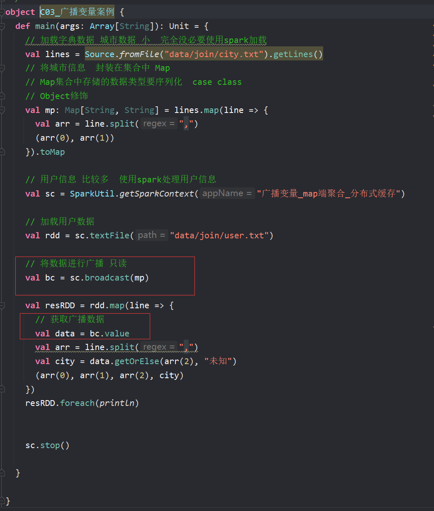

###什么是Spark
Spark是一种基于内存的计算的开源框架,核心是RDD

---

###stage的划分过程
以行动算子的runjob方法开始提交,根据RDD的血缘关系生成DAG有向无环图,再去Dviver端调用里面的dagScheduler方法,,拿到DAG后去根据当前job的finalRDD往前推断,遇到了窄依赖就将该RDD收入到stage里,而遇到宽依赖也就是Shuffle就会从该处切开生成新的stage,而一共只有两个stage名字,在结尾的叫resultstage,其余的都是shufferMapStage

---

###介绍一下shuffer
shuffer也就是洗牌的意思,定义为数据无法完成想要的结果需要重新分来得到结果的过程,而shuffer的动态效果就是上游节点汇聚到不同的节点也就是一个人生了多胎.
在现在的3.0spark中shuffer有三种,都归于shuffermanager来管
第一种为BypassMergeSortShuffle,要求map端不能聚合且分区数不能大于200
第二种为unsafeShuffer,要求必须能序列化且不能map端聚合以及reduce不得多于2^24个
第三种为sortshuffer,前两种都不满足就会使用这一个

---

###什么是分区
首先分区在Spark里RDD有分区,是RDD并行计算的最小单元,RDD的计算逻辑被划分为多片,每片为一个分区,分区的创建是为了更快更多量更高效的完成作业

---

###太多分区好吗
不好,因为一个分区代表一个任务,调度任务也是需要时间的所以也会影响效率或者造成资源浪费

###太少分区好吗
不好,因为分区太少会导致每个任务的数据量增大,对内存的要求就变高,并行度也会相应减少,效率也会低

---

###什么是分区器
首先Spark分区器只能用于keyvalue形式中的RDD,分区器描述的就是RDD的数据在各个分区的的分布规则
最常用的为Hashpartitioner分区器,另外还有Rangepartitioner分区器(使用到了水塘抽样算法)
还有就是自定义的分区器, 只需要继承partitioner 重写方法就行

###手写一个分区器

---

###什么是RDD
RDD是弹性分布式数据集,其内在与scala中的迭代器很相似,是封装数据逻辑的一个迭代器
RDD有五大特性
1. 计算函数特性,每个RDD封装着计算逻辑
2. 依赖或者叫血缘关系特性,RDD会存储着前面RDD信息用于提高容错
3. 分区特性,在RDD上有着并行计算的能力
4. 可选项的分区器特性
5. 可选项的位置优先特性,有着数据不动代码动的原则

---

###Spark standAlone模式下的client提交方式
该模式适合测试使用,因为如果要提交100个Application到集群上执行,那客户端就会开启多个Driver而出现网卡暴增的情况
1. client模式下提交任务之后会在客户端启动Driver进程
2. Driver会向Master为当前Application申请启动资源
3. 资源申请成功后,Driver调用TaskScheduler将任务发送到Worker端执行任务
4. Worker端将Task执行情况和执行结果返回给Driver端

###Spark standAlone模式下的cluster提交方式
1. cluster模式下提交应用程序之后,会向Master申请启动Driver
2. Master接收请求后,随机在一台Worker端启动Driver
3. Driver启动后向Master为Application申请资源
4. 资源申请成功后,Driver调用TaskScheduler将任务发送到Worker端执行任务
5. Worker将执行情况和执行结果返回给Driver端

###Spark Yarn模式下的client提交方式
1. 客户端提交了submit进程并向RM请求启动AM,并在客户端启动一个Driver
2. RS收到请求后随机在一台NM启动AM
3. AM启动后会去找RM申请一批容器用于请求启动Executor
4. RS收到请求后向AM返回一批NM节点
5. AM会向NM发送命令启动Executor
6. Executor进程启动后会向**Driver**反向注册，Executor全部注册完成后Driver开始执行main函数，之后执行到Action算子时，触发一个job，并根据宽依赖开始划分stage，每个stage生成对应的taskSet，之后将task分发到各个Executor上执行。

###Spark Yarn模式下的cluster提交方式
1. 客户端提交submit进程并向RM请求启动AM
2. RS收到请求后会在集群中随便找个NM启动AM(相当于Driver)
3. AM启动之后,向RS申请一批容器用于启动Executor
4. RS收到请求后,向A向AM返回一批NM节点
5. AM会向NM发送命令启动Executor
6. Executor进程启动后会向**AM**反向注册，Executor全部注册完成后AM开始执行main函数，之后执行到Action算子时，触发一个job，并根据宽依赖开始划分stage，每个stage生成对应的taskSet，之后将task分发到各个Executor上执行。

---

###reduceByKey与groupByKey的区别,哪一种更具优势?
redeceBykey按照key进行聚合,在shuffer之前有预聚合的操作,返回结果是RDD
> reduceByKey((x1,x2)=>x1+x2) x1为第一个元素,之后为每次计算的结果 x2为之后的元素
> 
groupByKey按照key进行聚合分组,直接进行shuffer

---

###Repartition和Coalesce 的关系与区别
关系就是他们都能改变分区数,
区别就是coalesce默认是不shuffer的一般用来减少分区
而repartition一般用来增加分区

---

###简述下Spark中的缓存(cache和persist)与checkpoint机制，并指出两者的区别和联系 
cache和persist的数据是缓存到内存或者HDFS上,会被清除,不会切断依赖链

而checkpoint的数据是永久保存到HDFS上,会斩断链条
一般checkpoint之前先要persist,这样执行起来会快一些

---

###简述Spark中共享变量（广播变量和累加器）的基本原理与用途(还有闭包)
累加器是一种分布式的变量器,即分布式改变,累加器就聚合这些事件,一般用来对作业执行过程的事件进行计数,只有执行了行动算子才会触发累加器
> 

> 自定义累加器
> 

广播变量是在每个worker端缓存一份不可变的只读的相同的变量,该节点的每个任务都能访问,起到节省资源和优化的作用,通常用来分发较大的对象
>

闭包为函数可以访问函数外部定义的变量,而在函数内改变变量不会改变外部的变量

---

###Spark内存分布
现版本的分了三个大区
1. 统一内存区占了百分之六十,里面分了缓存内存区和执行缓存区
2. 其他区,占了百分之四十,用于定义自定义数据结构或者是存放Spark元数据
3. 预留区,默认为300M用来进行容错性

