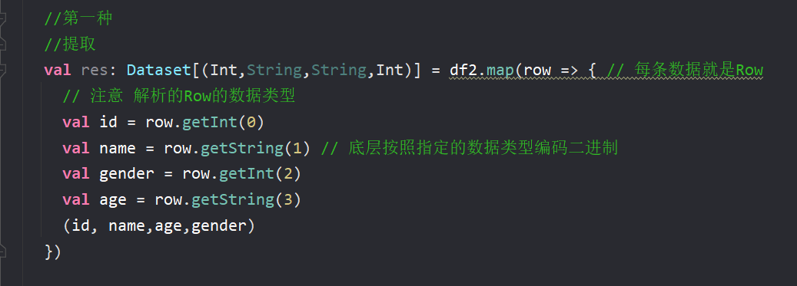
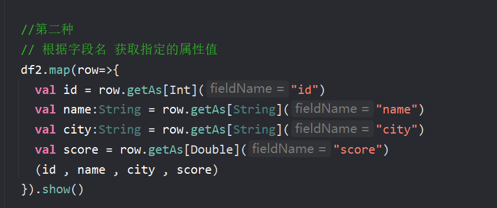
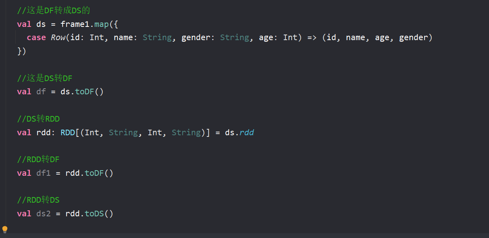
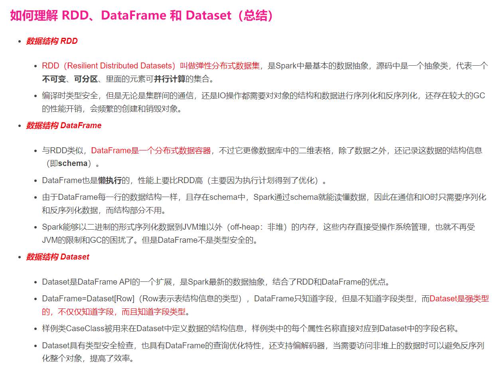

show 默认显示 20 行 可以更改

System.setProperty("HADOOP_USER_NAME","root") 可以设置用户 跳过权限

解析方法
> 

> 

DF转DS转RDD
> 

session.createDataFrame(rdd) 这样的创建方式没有字段名

不能将scalaBean转换成DF 没有.toDF 方法
但是可以  session.createDataFrame(rdd , class[Account]) 
这样的方法需要 case class 
普通的java就需要javabean一整套

DF存入hive里面  
1. df.write.saveastable  \
2. 纯sql 方式  insert into table xx 

//分区表的输出
//在hdfs的 data/acc_log/下有每天的日志数据,需要加载成dateframe 然后存储到hive的分区表

1. 创建schema  new StructType() add.("id",DATATypes.Integer)...
2. df03 = session.read.schema(schema).csv(2021-12-03)
3. df03.write.saveastable() //只能实现动态分区
4. 静态分区写法就是 spark.sql( insert into table xx partition (dt='2021-12-03'))
5. 动态分区写法就是 spark.sql
6. ( insert into table xx partition (dt) 
7. select)

ds只要执行了sql算子 就会变成df

1.sparksession将一个RDD转成dataset,需要传入一个Encoder 用于用户的RDD元素对象中通过反射的方式生成schema 
而Encoder参数被顶部一成了隐式参数 所以通常我们让他自动隐式传入 import spark.implicits._

2.sparksession将rdd转成dataframe  createDataFrame(rdd,classof[xxx]) 反射 //且class一定要case
元组类型的RDD可以直接转成df caseclass 也可以

3.ds或者df转RDD ds.rdd df.rdd 转成的一定是rdd[row] 因为df就是ds[row]

4.ds转df .toDF 
5.df转ds .as[case class] 把df转成caseclass的ds 会自定传入Encoder

RDD\DataFrame\Dataset的解释
> 