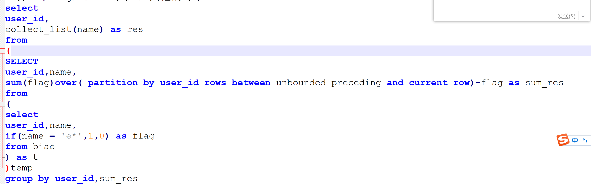

给宽表改字段
先修改成内部表 添加新的字段名
再将他设置成外部表

给宽表新增字段
表名修改 
创建新表,将需要加的字段加上去 
将原来的数据全部导入到新表 设置动态分区 新增字段全部为null
最后再将任务重跑

这个比例每天增量100g，集群规模是10台，两台内存64,8台内存32,硬盘机械40T,固态2T   
我记得不是太清楚了。。。之前搭建集群的时候有参与过，应该是。。。。多少台，一台具体是什么情况  

行为数据不会存很久 业务数据永久保存

user_id,name
u1,e1
u1,e1
u1,e*
u1,e2
u1,e3
u1,e*
u2,e1
u2,e2
u2,e*
u2,e1
u2,e3
u2,e*
u2,e*
上面的用户行为记录，每遇到一个e*，就分到一组，得到如下结果：
u1, [e1,e1,e*]
u1, [e2,e3,e*]
u2, [e1,e2,e*]
u2, [e1,e3,e*]
u2, [e*]

spark sql mr 运行在yarn 上的时候 平时跑五分钟 突然20分布在 怎么排查
然后进入8088yarn的界面上 
找到所有的job 
点击log
把我们想要查找的失败job在搜索框中查找 

如果是spark
可以从有向无环图上定位到具体卡在哪个算子上了，执行过的是有颜色的，断掉的，没有执行的就是灰色的 
json解析没有解析成功。。 
1.去查日志，定位到代码或者sql的逻辑 
2.查看代码，从逻辑和数据上去分析 
3.找到具体原因然后修改 

spark 参数设置
--driver-memory 2G    //分配给Driver的内存。
--driver-cores 1      // 分配给Driver的Vcore。
--executor-cores 2    //分配给Executor的Vcore。
--executor-memory 8G  //分配给Executor的内存。
--num-executors 3     //分配的Executor的个数。

rowkey设置
我的业务字段中，有一个唯一值。。。在这个唯一值上前面或者后面加一个固定的标识 
az_唯一键   bl_唯一键 

同步的频率 也就是全量增量的问题
atlas 质量管理 血缘关系 以及

调度每天百八十个 

可以做多份简历具体投到自己喜欢的公司
可以包装爱彼迎!!!!!