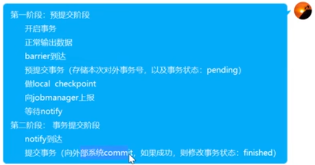

同步 一个线程  异步  多个线程
flink使用异步IO的使用场景 
flink可以高效的请求外部的数据库 API获取想要的数据库

异步IO和广播状态的区别:
异步IO是来一条数据查询一次数据库 API
广播状态也可以关联维度数据,但是数据量不能太大,数据而且是已经存在的数据 有可能无法获取全部的数据
异步IO : 可以查询的数据即使再大也没关系 

同步查询和异步查询的区别
相同的并行数据 即subtask数量相同 异步IO效率更高 但是要额外多消耗cpu资源

数据至少一次
source支持偏移量 sink支持覆盖写 幂等性
原理是 source端记录了偏移量在状态里 

数据一致性 
source支持偏移量  sink支持事务

涛哥视频观看flink准确一致性 

(mysql kakfa sink eos)
sink段容错机制
1. 目标存储系统支持幂等写入
幂等写入方式的缺点就是 过程中会有不一致的情况,举个例子,如果一个单词带着随机数写入到数据库里,但因为宕机重启后第二次写入到数据库的时候数字就会不同,那么消费者所消费的数字也会不同
2. 两阶段的事务写入 
目标存储系统要支持事务机制
首先sink处理这批数据时,开始输出数据,启动预提交事务,将事务信息存放到某个地方,然后这批数据搞定了就做个checkpoint,等到所有算子收到checkpoint成功信息之后,再提交事务,如果checkpoint完成了但是没提交事务就宕机,重启时sink算子就会找事务信息,先提交事务再继续完成下一次的写入(事务信息保存状态会从Pending -> finished)

3. 两阶段预写日志(不支持事务和幂等性的数据库)
也就是sink算子自己会实现存储一份日志,等到checkpoint提交成功了再将日志发送给数据库

Task是 算子的封装  
watermark 200ms刷新一下定时器 决定watermark值
接收单并行的watermark 值 就是最大的值
而接收多并行的watermark值就是两边数据中的watermark最小的
此时超过了watermark的数据被存到了未来桶里,直到窗口被触发才开始显示

分发机制默认是轮询