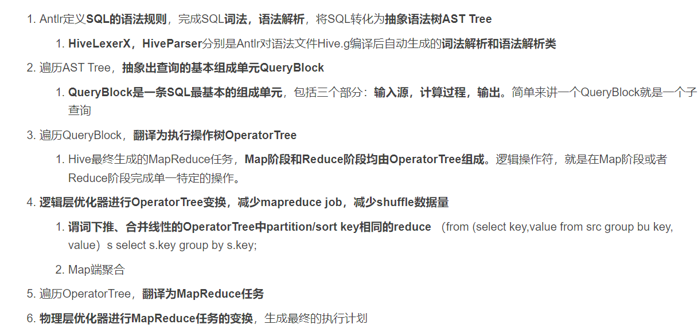
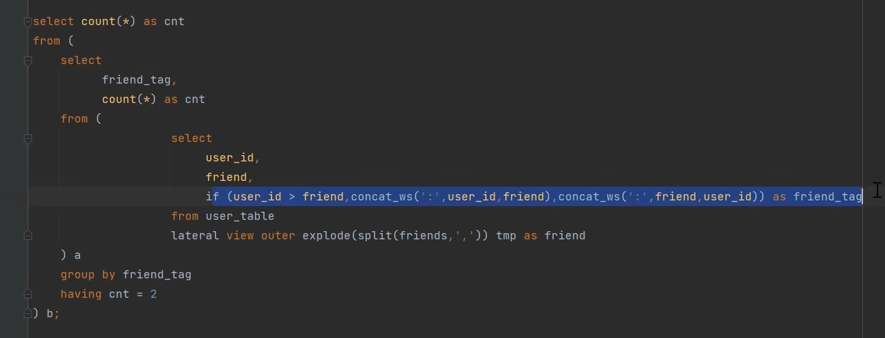

### Hive内部表和外部表的区别
* 没有被external修饰的是内部表,被external修饰的是外部表
区别在内部表由Hive自身去管理,外部表由HDFS管理,Hive无法删除外部表这个文件,只能删除元数据

---

### 请说明hive中 Sort By，Order By，Cluster By，Distrbute By各代表什么意思?
* **Order by** :会对整个表全局排序,因此只有一个reducer进程
* **Sort by**:会在数据进入reducer之前完成排序,且设置reduce数量很多时,他就会在单个reduce生成的文件中排序,而不是全局排序
* **Distribute by**:按照指定的字段对数据进行划分输出到不同的reduce中。
* **Cluster by**:除了具有 distribute by 的功能外还兼具 sort by 的功能 但是只能正序排列


---
### Hive小文件造成的原因与影响
1. 动态分区导致的,以及数据源本身就会带很多的小文件
2. sqoop增量导入的时候,或者是flume参数没调好
*  造成的影响一个是map数量变多,会严重影响性能,第二个是元数据会存到namenode里,小文件数量多了会影响namenode寿命,查找索引的速度也会变慢


---
### Hive小文件过多怎么解决
1. 一般是使用hive自带的concatenate命令,但这个命令只支持ORC和RCFile文件类型 
   **也就是(alter table A concatenate)**
2. 调整Map的数量,这个和任务切片的大小和文件数量有关,所以常用的调整要么是把切片大小改为256M,要么就是去用combineFlieformate的方法提前把小文件合并或压缩
3. 减少reduce的数量 直接去设置
4. hadoop的archive命令小文件归档

---
### 数据倾斜怎么解决

   * 实际上，绝大部分的数据倾斜都产生在Shuffle阶段，我们一般是去Yarn的UI界面上或者是hive EXPLAIN(hive执行计划)去发现问题--定位问题--根据问题原因分类优化
   * 我们首先找到执行时间较长的stage，判断stage是否倾斜。
   * 找到stage后，根据提示信息即可定位大致的问题，找到SQL问题位置，然后分析表的key值分布，表的大小，确定问题，进行程序优化。 

1. 空值引发的数据倾斜
   1. 可以直接不让null值参与join操作,即不让null值有shuffle阶段,**也就是where条件过滤掉空值**
   2. 用随机数冲散堆积在一个reduce中的很多null **也就是concat rand** 
   *(某 key 值大量重复产生数据倾斜解释：如果key均为空值，大量的key会分布在同一个Reduce节点上；在其他Reduce节点完成ReduceTask后，存在大量空值的Reduce还未完成Task，因此产生数据倾斜。 concat('dp_hive',rand())是为了把空值变成一个字符串加上随机数的，把 null值倾斜的数据分布在不同Reduce节点上，间接把倾斜的数据分布在不同Reduce上。)*
2. 表关联引发的数据倾斜
    * 通常是将倾斜的数据存到分布式缓存中，分发到各个Map任务所在节点。**在Map阶段完成Join操作，即Mapjoin**，去开启就行了,但有个前提是**内存足以装下该全量数据**,这样避免了Shuffle，从而避免了数据倾斜。
3. group by分组时候key值分布不均
   * 先局部聚合再全局聚合。局部聚合时候给每个key值加上随机前缀进行打散，原本相同的key值会变成不同的新key值，便可以让原来由一个task处理的数据根据加上随机前缀后的新key值分散到多个Task上做聚合，从而缓解单个task处理数据量过多的问题。再去除随机前缀做全局聚合，既可以得到最终结果。
        - 优点：对于聚合类操作导致的数据倾斜效果明显，可以大幅缓解数据倾斜问题，提升作业执行效率。
        - 缺点:只适用于聚合类场景，不适用于join等其它操作。
4. 增加reduce个数
5. 其实最多的还是增加资源，因为懒


--- 
### Hive和RDBMS(关系型数据库)有什么区别
* 两个没有什么关联性,只是长得像而已,HIve属于一个工具,通过sql转化为mapreduce然后提交到集群上去运行计算逻辑
* hive的计算引擎是hadoop的mapreduce，存储是hadoop的hdfs文件系统，
而RDBMS的引擎由数据库自己设计实现例如mysql的innoDB，存储用的是数据库服务器本地的文件系统
* hive存储的数据量比较大，适合海量数据，适合存储轨迹类历史数据，适合用来做离线分析、数据挖掘运算，事务性较差，实时性较差
*  hive的SQL为HQL，与标准的RDBMS的SQL存在有不少的区别，相对来说功能有限
RDBMS的SQL为标准SQL，功能较为强大。

---
### Hive的函数：UDF、UDAF、UDTF的区别
首先他们都是自定义的函数,当内置函数满足不了业务需求的时候就自己开发
*   UDF它就是针对一行进行处理然后返回一行 就像一列的String全都转成大写的函数
*   UDAF就是处理多行数据但是返回一行 就像求最小值最大值 或者是平均值这种
*   UDTF就是处理一行数据但是返回多行 就像函数里有个explode函数 把一行数据炸开返回多行

---
### Hive分区与分桶
*  分区:在Hive中的分区就是根据分区值对表的粗略划分,在HDFS上存储的时候会分层,使用分区就是为了去为了取值是不用全表扫描而得到结果从而达到查询速度获得提升.(partitioned by )
*  分桶:分桶是根据字段的hash值除以桶的个数取余数来让数据划分到桶里,一般情况就是分区不够细还需要在分的时候就需要分桶,我所认知的分桶有两个作用,第一个是和查询速度有关,第二个就是使用抽样查询时候会更有说服力吧.(clustered by)

---
### Hive存储的格式
1. **TextFlie** 默认的格式
2. **SequenceFlie** 使用方便,可切割,可压缩,SequenceFile支持三种压缩选择： NONE ， RECORD ， BLOCK 。Record压缩率低， 一般建议使用**BLOCK**压缩。
3. **ORCFlie** 是RCFlie的改良版本,数据是按行分块的列式存储,能跳过不必要的列进行读取


---
### Hive的静态动态分区
*  静态分区 
   *  实际上就是手动指定分区的值,这种对小批量分区插入比较友好
*  动态分区
   *  当往hive分区表中插入数据时,如果需要创建的分区很多,比如以表中某个字段进行分区存储,则每次插入sql都要修改字段,效率就会低.所以就有了hive的动态分区功能,就可以基于参数的位置去推断分区的名称,从而建立分区.
   *  动态分区是要去打开的 
   *  set hive.exec.dynamic.partition =true（默认false）
   *  set hive.exec.dynamic.partition.mode = nonstrict(默认strict),表示允许所有分区都是动态的，否则必须有静态分区字段
---

### Hive内部结构
1. 最头头是用户的接口,常用的是CLI
2. 第二层是Hive内部四个执行流程
   * 解析器(解析sql语句)
   * 编译器(将sql语句转化为mapreduce看得懂的语句)
   * 优化器(优化mapreduce程序)
   * 执行器(将结果提交到HDFS上)
3. 后面有个元数据存储,通常存到mysql或者derby中

---

### Hive转化成MR的过程(执行过程)(了解一下,走个大概)

大致就是首先把sql语句转化成语法树,根据语法树生成了QueryBlock,然后遍历QueryBlock,将他翻译为操作执行树,再优化这个逻辑之后翻译成MR的任务,物理层优化器进行mapreduce任务的变换,生成最终的执行计划

---
##Hive企业级调优方案
1. 建表优化
   1. 分区分桶表
   2. 数据或文件的压缩  
2. 参数优化
   1. 提前合并小文件
3. sql优化
   1. 大小表join问题(开启mapjoin处理)
   2. 大大表join问题(空值过滤和空key转换)
   3. 谓词下推(嵌套select),分区裁剪,
   4. sort by代替order by (启动多个redece) 一般配合distribute by 或者有个综合 clustered by 
   5. group by代替distinct
   6. 合理设置map和reduce数量
   7. 避免笛卡尔积


---
##Hive行转列
```sql

/* 原始数据
name       gender          times
张三         男            唐
李四         男            唐
王五         男            明
赵六         男            明
*/
-- 先用collect_set将列拼接在一起，然后再通过concat_ws进行展开拼接
SELECT 
    a.gender_times, concat_ws(';',collect_set(a.name)) name
FROM
(
    SELECT 
        name, concat(gender, '_','times') gender_times
    FROM hero_info
) tmp
GROUP BY t.gender_times
 
/*查询结果
gender_times    name    
男_唐     张三;李四
男_明     王五;赵六

```
##Hive列转行
```sql

/*原始数据
province       city
河南           郑州市,开封市，洛阳市
河北           石家庄市，保定市
湖南           长沙市，岳阳市，常德市
*/
 
-- addr为表名
SELECT
    province, city_n
FROM addr 
LATERAL VIEW explode (split(city,',')) addr_tmp AS city_n
 
/*
-- 查询结果
河南      郑州市
河南      开封市
河南      洛阳市
河北      石家庄市
河北      保定市
湖南      长沙市
湖南      岳阳市
湖南      常德市
*/
```
---
###Hive order by 排序时null值的处理


###HIve != 遇到空值时的处理
1. NVL(参数1,参数2,参数3) 函数 
2. if(a='',未知,a)


###hive sql题 


简单来说就是用space函数去传入两值相减得到的天数生成一串(0 1 2)这样的内容,再用split切割后得到一串数组后炸开,再用select 查询时最后一天对每个炸开的数相减,就能得到日期


###HIve随机抽样百分之10的数据


---


### 七日留存率的sql实现
```sql
select
a.date as date
, sum((case when datediff(b.date,a.date)= 1 then 1 else 0))/count(a.uid) as '次日留存率'
, sum((case when datediff(b.date,a.date)= 3 then 1 else 0))/count(a.uid) as '三日留存率'
, sum((case when datediff(b.date,a.date)= 7 then 1 else 0))/count(a.uid) as '七日留存率'
from
   （
   select uid
      ,substr(datetime,0,10) as date
   from 
       table
   group by uid 
           ,substr(datetime,0,10)
）a
   left join 
   (
   select uid
      ,substr(datetime,0,10) as date
   from 
       table
group by uid 
        ,substr(datetime,0,10)
)b on a.uid=b.uid and a.date < b.date ---加上了第二个条件可以将join后的表记录数减少一半
group by a.date
```


### 怎么查看hive有什么自带的函数,怎么查看函数的详细信息
show functions 和 desc functions extended xxx


### hive留存率的计算步骤
1. 进行表的自身关联,过滤出右表日期大于左表日期的行为日志
2. 根据行为日期差值计算出1/3/7 日的留存用户数(count), date_diff (右表减左表日期等于1 3 7)    --> count(distinct if (diff_date = 1 , a.userid,null))
3. 计算用户留存率 留存率= X日留存用户数/基准日活跃用户数    


### hive pv累加趋势图问题
1. 进行表的自身关联,过滤出左表大于右表日期的行为日志
2. 在上面结果的基础上,直接对右表数据部分进行聚合,就得到了左表下的右表聚合   

或者用开窗函数sum()over()

### hive uv(比pv多了去重的操作,因为用户可能会在不同的月份进行多次访问,也只能算一个人)累加趋势图的问题
1. 进行表的自身关联,过滤出左表大于右表日期的行为日志
2. 在上面的结果上,对右表进行去重count操作

不可以用开窗函数 

### hive 互为好友问题
1. 进行表的子关联,过滤出护卫好友的信息
2. 在上面结果的基础上,进行好友对数计数,结果除以2

第二种解题思路
if(user_id > friend , concat_ws(':',user_id,friend),concat_ws(':',friend,user_id))  打上标记
lateral view outer explode(split(friends,',')) 炸开     

 
妙啊 

### hive求同时在线问题
1. 将数据进行拆分,在线记录为1 , 离线记录为-1  union all
2. 通过开窗函数累加计算 sum (flag) over (order by time asc)
3. 求最大值就是 max 就行 

求高峰时间段 也就是峰值对应的时间到峰值下一条记录的时间
lead(time,1)over (order by time asc )


-----
### hive的元数据服务和hiveserver2服务是什么关系，或者说hive的metastore服务可以不开吗？
1. metastore服务只是让Mysql可以让别的Hive的机器可以连上。
2. hiveserver2的作用就是让hive启动为一个后台服务，因为只有启动为后台了，才可以让jdbc这些程序去连接hive
Beeline 和 jdbc-hive 底层都是通过HiveServer2连接的MetaStore，
metastore再去连接MySQL数据库来获取或者存取元数据。所以，metastore服务是要开的。


### hive中 count（distinct）会在mr发生什么
hive在处理count这种全聚合计算时候，会忽略用户指定的reduceTask数，然后强制使用1，加入distinct map阶段就不能用combine消重，所以可以子查询distinct，这样去重就分发到不同的reduce块。count只用一个拿来计数就可以
