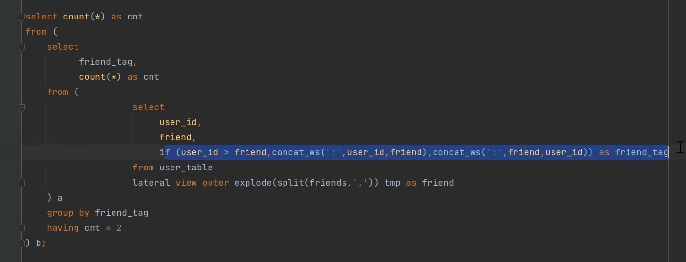

### Hive内部表和外部表的区别
* 没有被external修饰的是内部表,被external修饰的是外部表
区别在内部表由Hive自身去管理,
外部表由HDFS管理,Hive它没办法删除外部表这个文件,只能删除元数据

hive默认创建是内部表,把数据移动到数据仓库指向的路径,而创建外部表,仅记录数据梭子啊的路径,不对数据的位置做任何的改变

---

### 请说明hive中 Sort By，Order By，Cluster By，Distrbute By各代表什么意思?
* **Order by** :会对整个表全局排序,因此只有一个reducer进程
* **Sort by**:会在数据进入reducer之前完成排序,且设置reduce数量很多时,他就会在单个reduce生成的文件中排序,而不是全局排序
* **Distribute by**:按照指定的字段对数据进行划分输出到不同的reduce中。
* **Cluster by**:除了具有 distribute by 的功能外还兼具 sort by 的功能 但是只能正序排列

---
### Hive小文件造成的原因与影响
1. 动态分区导致的,以及数据源本身就会带很多的小文件
2. sqoop增量导入的时候,或者是flume参数没调好

影响 
1. 元数据的影响,因为namenode将文件系统的元数据放在内存里面嘛,就会导致namenode的内存大小被撑爆
2. 对mr会有影响,因为每个文件都会启动一个map task 如果小文件太多的话就会影响性能
3. 在hdfs的读流程里,如果小文件越多的话 寻址花费的时间就越多.

---
### Hive小文件过多怎么解决
1. 一般是使用hive自带的concatenate命令,但这个命令只支持ORC和RCFile文件类型 
   **也就是(alter table A concatenate)**
2. 调整Map的数量,这个和任务切片的大小和文件数量有关,所以常用的调整要么是把切片大小改为256M,要么就是去用combineFlieformate的方法提前把小文件合并或压缩
3. 减少reduce的数量 直接去设置
4. hadoop的archive命令小文件归档

### HDFS小文件
HDFS小文件解决方案
1. Hadoop Archive
Hadoop Archive或者HAR，是一个高效地将小文件放入HDFS块中的文件存档工具，它能够将多个小文
件打包成一个HAR文件，这样在减少namenode内存使用的同时，仍然允许对文件进行透明的访问。
2. Sequence file
sequence file由一系列的二进制key/value组成，如果为key小文件名，value为文件内容，则可以将大
批小文件合并成一个大文件。
3. CombineFileInputFormat
用于将多个文件合并出成单独的Split，另外，它会考虑数据的存储位置。
4. 开启JVM重用
原理：一个Map运行在一个JVM上，开启重用的话，该Map在JVM上运行完毕后，JVM继续运行其他
Map。（mapreduce.job.jvm.numtasks）
，对于大量小文件Job，可以减少45%运行时间

---

### Hive数据倾斜或者跑得慢怎么定位的然后排查和解决
数据倾斜的根本原因是数据的key分布不均，个别key数据很多，超出了计算节点的计算能力的结果

过程：数据经过 map后，由于不同key 的数据量分布不均，在shuffle 阶段中通过 partition 将相同的 key 的数据打上发往同一个 reducer 的标记，然后开始 spill （溢写）写入磁盘，最后merge成最终map阶段输出文件。

判断数据倾斜的方式

1、分析节点资源管理器，如果大部分节点已经执行完成，而个别节点长时间执行不完，很可能发生了数据倾斜；
2、分析执行日志，作业在reduce阶段停留在99%，很长时间完成不了，很可能发生了数据倾斜。

   就比如说在华北地区的民宿中,只有北京独领风骚,造成key值只有北京多得令人发指的程度

   * 实际上，绝大部分的跑得慢的原因和数据倾斜的原因都产生在Shuffle阶段，我们一般是去Yarn的UI界面上或者是hive EXPLAIN(hive执行计划)去发现问题
   * 我们首先找到执行时间较长的stage，判断stage是否倾斜。
   * 然后就可以根据提示信息定位找到SQL问题位置，然后分析表的key值分布，表的大小，进行优化。 

一般遇到数据倾斜我们都会先开启负载均衡
也就是map端combine参数 和 负载均衡参数 
set hive.map.aggr=true
set hive.groupby.skewindata=true 
这两步主要任务就是 会生成两个MR job 
第一个MR job,map端输出的结果会随机分布到reduce中,然后对每个reduce做部分聚合的操作再去输出结果,这样做的好处就是相同的group by key就会有可能分发到不同的reduce中
第二个mr job是再根据预处理的数据结果按照group by key 分散再reduce中,保证相同的key分发到同一个reduce

然后分为几种场景嘛
1. 空值引发的数据倾斜
   1. 可以直接不让null值参与join操作,即不让null值有shuffle阶段,**也就是where条件过滤掉空值**
   2. 用随机数冲散堆积在一个reduce中的很多null **也就是concat rand** 
   *(某 key 值大量重复产生数据倾斜解释：如果key均为空值，大量的key会分布在同一个Reduce节点上；在其他Reduce节点完成ReduceTask后，存在大量空值的Reduce还未完成Task，因此产生数据倾斜。 concat('dp_hive',rand())是为了把空值变成一个字符串加上随机数的，把 null值倾斜的数据分布在不同Reduce节点上，间接把倾斜的数据分布在不同Reduce上。)*
2. 小表join大表的话 设置两个参数嘛
    1. set hive.auto.convert.join = true 如果是小表，自动选择map join:
    2. hive.mapjoin.smalltable.filesize=25000000  调大小表的阈值，默认值是25mb
    3. 如果小表没办法mapjoin 拿我们就会用小表扩容的方式 也就是用添加新字段12345678后用炸裂函数列转行扩容 然后对大表用cancat(rand)拼接前缀打散数据  这样就保证了大表数据被打散之后还能join上
3. 如果是大表join大表的数据倾斜
    1. 我以实际场景举个例 我们之前有个汇总表也就是房东共和用户的交易汇总,也就是每个房东最近90天成交金额,把他称为A表吧,B表是用户基本信息表,那我们一开始肯定是直接join两个表进行统计对吧,但是这样因为房东这边的二八原则,就是牛的民宿并且好的又贵又被订了很多次,别的冷门的就订单少成交金额也少,于是大房东就引发了数据倾斜,本身又没办法做到mapjoin
    2. 所以我们方案就是先把null值随机分发嘛,也就是给Null值concat赋值,但问题就在倾斜的卖家大量存在而且动态变化的,所以这个方案没用
    3. 那我们就建立一个number表,只有一列的int值,然后放大用户表10倍,再去取模join,核心思路就是既然是这个卖家分发会数据倾斜,那么我们人工增加一列进行分发,这样倾斜的呃值就是原来的十分之一,但这样做的弊端就是用户表会膨胀好多倍,而且逻辑又复杂,头疼得很
    4. 之后我们也就是我们对倾斜得key和不倾斜的分开处理,不倾斜的正常join就好,也就是先找出大的房东,建立一张临时表存放倾斜的key, 也就是 where找到大房东,然后对他进行 /*+mapjoin(b)*/,然后union正常join的就好了。

OOM的原因还有 sql的语法问题 或者是数据量太庞大。

--- 
### Hive和RDBMS(关系型数据库)有什么区别
* 两个没有什么关联性,只是长得像而已,HIve属于一个工具,通过sql转化为mapreduce然后提交到集群上去运行计算逻辑
* hive的计算引擎是hadoop的mapreduce，存储是hadoop的hdfs文件系统，
而RDBMS的引擎由数据库自己设计实现例如mysql的innoDB，存储用的是数据库服务器本地的文件系统
* hive存储的数据量比较大，适合海量数据，适合存储轨迹类历史数据，适合用来做离线分析、数据挖掘运算，事务性较差，实时性较差
*  hive的SQL为HQL，与标准的RDBMS的SQL存在有不少的区别，相对来说功能有限
RDBMS的SQL为标准SQL，功能较为强大。

---
### Hive的函数：UDF、UDAF、UDTF的区别
首先他们都是自定义的函数,当内置函数满足不了业务需求的时候就自己开发
*   UDF它就是针对一行进行处理然后返回一行 就像一列的String全都转成大写的函数
*   UDAF就是处理多行数据但是返回一行 就像求最小值最大值 或者是平均值这种
*   UDTF就是处理一行数据但是返回多行 就像函数里有个explode函数 把一行数据炸开返回多行

---

### Hive分区与分桶
*  分区:在Hive中的分区就是根据分区值对表的粗略划分,在HDFS上存储的时候会分层,使用分区就是为了去为了取值是不用全表扫描而得到结果从而达到查询速度获得提升.(partitioned by )
*  分桶:分桶是根据字段的hash值除以桶的个数取余数来让数据划分到桶里,一般情况就是分区不够细还需要在分的时候就需要分桶,我所认知的分桶有两个作用,第一个是和查询速度有关,第二个就是使用抽样查询时候会更有说服力吧.(clustered by)

### 分区需要注意的
1. 值太多的字段不能做分区,会产生很多小文件
2. 分区字段不建议使用中文

---
### Hive存储的格式
1. **TextFlie** 默认的格式
2. **SequenceFlie** 使用方便,可切割,可压缩,SequenceFile支持三种压缩选择： NONE ， RECORD ， BLOCK 。Record压缩率低， 一般建议使用**BLOCK**压缩。
3. **ORCFlie** 是RCFlie的改良版本,数据是按行分块的列式存储,能跳过不必要的列进行读取

### Orc和Parquet区别
区别的话我只知道ORC是支持事务的，只是支持事物的表必须是分桶表，而parquet不支持事务
还有就是性能方面ORC读取的速度应该是比Parquet快的

### 为什么你们公司要用parquet
实际生产中，使用Parquet存储，lzo压缩的方式更为常见，这种情况下可以避免由于读取不可分割大文件引发的数据倾斜。 但是，如果数据量并不大（预测不会有超大文件，若干G以上）的情况下，使用ORC存储，snappy压缩的效率还是非常高的。

因为Hive 的SQL会转化为MR任务，如果该文件是用ORC存储，Snappy压缩的，因为Snappy不支持文件分割操作，所以压缩文件「只会被一个任务所读取」，如果该压缩文件很大，那么处理该文件的Map需要花费的时间会远多于读取普通文件的Map时间，这就是常说的「Map读取文件的数据倾斜」。

那么为了避免这种情况的发生，就需要在数据压缩的时候采用bzip2和Zip等支持文件分割的压缩算法。但恰恰ORC不支持刚说到的这些压缩方式，所以这也就成为了大家在可能遇到大文件的情况下不选择ORC的原因，避免数据倾斜。

---
### Hive的静态动态分区 
1. 静态分区 
实际上就是手动指定分区的值,这种对小批量分区插入比较友好
2. 动态分区
  1. 当往hive分区表中插入数据时,如果需要创建的分区很多,比如以表中某个字段进行分区存储,则每次插入sql都要修改字段,效率就会低.所以就有了hive的动态分区功能,就可以基于参数的位置去推断分区的名称,从而建立分区.
  2. 动态分区是要去打开的 
     set hive.exec.dynamic.partition =true（默认false）
     set hive.exec.dynamic.partition.mode = nonstrict(默认strict),表示允许所有分区都是动态的，否则必须有静态分区字段

---

### Hive内部结构
1. 最头头是用户的接口
2. 第二层是Hive内部四个执行流程
   * 解析器(解析sql语句)   
   * 编译器(将sql语句转化为mapreduce看得懂的语句)
   * 优化器(优化mapreduce程序)
   * 执行器(运算完之后把运算的结果放到HDFS上)
3. 后面有个元数据存储,通常存到mysql或者derby中

---

### Hive转化成MR的过程(执行过程)(了解一下,走个大概)

大致就是首先把sql语句转化成语法树,根据语法树生成了QueryBlock,
然后遍历QueryBlock,将他翻译为操作执行树,
再优化这个逻辑之后翻译成MR的任务,物理层优化器进行mapreduce任务的变换,生成最终的执行计划

---

### Hive企业级调优方案
1. 建表优化
   1. 分区分桶表
   2. 数据或文件的压缩  
2. 参数优化
   1. 提前合并小文件
3. sql调优
   1. 大小表join问题(开启mapjoin处理)
   2. 大大表join问题(空值过滤和空key转换)
   3. 谓词下推(嵌套select),分区裁剪,
   4. sort by代替order by (启动多个redece) 一般配合distribute by 或者有个综合 clustered by 
   5. group by代替distinct
   6. 合理设置map和reduce数量
   7. 避免笛卡尔积

### 大大表join场景
之前就是有个id是bigint类型的 而另一个表是id是String类型的,然后我们用cast函数转化成Bigint
之后在对另一个表的字段过滤掉空值嘛,也就是is not null 还有什么长度大于0什么的
再对他做了将左边没关联上的key打散,也就是在关联前用cast ceiling rand 给左表设置随机数再去关联右表
这样就给它的key分布得均匀一些

然后跑批时间就从一个多小时变成两分多种

---

### 怎么查看hive有什么自带的函数,怎么查看函数的详细信息
show functions 
desc functions extended xxx

### hive pv累加趋势图问题
1. 进行表的自身关联,过滤出左表大于右表日期的行为日志
2. 在上面结果的基础上,直接对右表数据部分进行聚合,就得到了左表下的右表聚合   

或者用开窗函数sum()over()

### hive uv(比pv多了去重的操作,因为用户可能会在不同的月份进行多次访问,也只能算一个人)累加趋势图的问题
1. 进行表的自身关联,过滤出左表大于右表日期的行为日志
2. 在上面的结果上,对右表进行去重count操作

不可以用开窗函数 

### hive 互为好友问题

第二种解题思路
if(user_id > friend , concat_ws(':',user_id,friend),concat_ws(':',friend,user_id))  打上标记
lateral view outer explode(split(friends,',')) 炸开     

 
妙啊 

### hive求同时在线问题
1. 将数据进行拆分,在线记录为1 , 离线记录为-1  union all
2. 通过开窗函数累加计算 sum (flag) over (order by time asc)
3. 求最大值就是 max 就行 

求高峰时间段 也就是峰值对应的时间到峰值下一条记录的时间
lead(time,1)over (order by time asc )

-----

### hive的元数据服务和hiveserver2服务是什么关系，或者说hive的metastore服务可以不开吗？
1. metastore服务只是让Mysql可以让别的Hive的机器可以连上。
2. metastore服务是要开的，hiveserver2的作用就是让hive启动为一个后台服务，因为只有启动为后台了，才可以让jdbc这些程序去连接hive
Beeline 和 jdbc-hive 底层都是通过HiveServer2连接的MetaStore，
metastore再去连接MySQL数据库来获取或者存取元数据。

### hive中 count（distinct）会在mr发生什么,和group by比较哪个效率高
1. hive在处理count这种全聚合计算时候，会忽略用户指定的reduceTask数，然后强制使用只用一个，加入distinct的话 map阶段就不能用combine消重，
2. 所以可以子查询distinct，这样去重就分发到不同的reduce块。count只用一个拿来计数就可以

3. 而group by则会被hive翻译成分组聚合运算，会有多个reduce任务并行处理，每个reduce对收到的一部分数据组，进行每组聚合

但高版本的hive，对distinct进行了优化，其执行计划和group by的一样

### 常用调优参数
1. 内存相关参数
主要是调整底层mapreduce的task内存相关配置
mapreduce.map.java.opts=-Xmx2048m(默认参数，表示jvm堆内存)
mapreduce.map.memory.mb=2304
mapreduce.reduce.java.opts=-Xmx2048m(默认参数，表示jvm堆内存)
mapreduce.reduce.memory.mb=2304(container的内存)

2. mapreduce相关参数
-- 设置CombineHiveInputFormat来实现小文件合并任务降低不必要的并行度
set hive.input.format = org.apache.hadoop.hive.ql.io.CombineHiveInputFormat;  // 小文件优化
-- 设置任务分片的更细节参数，来调整map任务并行度
SET mapred.max.split.size = 256000000;  --最大切片
SET mapred.min.split.size = 64000000;  -- 最小切片
SET mapred.min.split.size.per.node = 64000000;  --每节点上的最小切片
SET mapred.min.split.size.per.rack = 64000000;  -- 每机架上的最小切片

-- 设置每个reduce任务处理的数据量，来控制reduce的任务数 ，默认64M
SET hive.exec.reducers.bytes.per.reducer = 256000000; 
-- 也可以在特定情况下，如分桶查询时，写死reduce任务并行数
set mapreduce.reduce.tasks = 4;

3. 小文件问题相关参数
// 默认true，在map-only任务结束时合并小文件
SET hive.merge.mapfiles = true;  

// 默认false，在map-reduce任务结束时合并小文件
SET hive.merge.mapredfiles = true;  

// 每个任务的文件合并目标大小，默认256M
SET hive.merge.size.per.task = 268435456;  

// 当输出文件的平均size < 该值时，启动一个独立的map-reduce任务进行文件merge
SET hive.merge.smallfiles.avgsize = 16777216;   

4. 其他了解
SET hive.exec.parallel = true; // 开启多job并行执行
SET hive.exec.parallel.thread.number = 16;

-- 设置jvm重用
SET mapred.job.reuse.jvm.num.tasks = 10;

-- 允许动态分区
SET hive.exec.dynamic.partition = true;

SET hive.optimize.cp = true;  // 列裁剪
SET hive.optimize.pruner = true;  //  分区裁剪

SET hive.groupby.skewindata = true;   // groupby数据倾斜优化

-- 自动判断能否本地执行，提高效率
SET hive.exec.mode.local.auto = true;  
SET hive.exec.mode.local.auto.input.files.max = 10; // 转为本地执行的最大输入文件个数
SET hive.exec.mode.local.auto.inputbytes.max = 128000000  // 转为本地执行的最大输入数据量128M

数据倾斜参数
checkinterval：设置map端预聚合的行数阈值，超过该值就会分拆job。
hive.map.aggr=true //默认
hive.groupby.mapaggr.checkinterval=100000 // 默认

倾斜均衡配置 Hive自带了一个均衡数据倾斜的配置项
hive.groupby.skewindata=false // 默认

