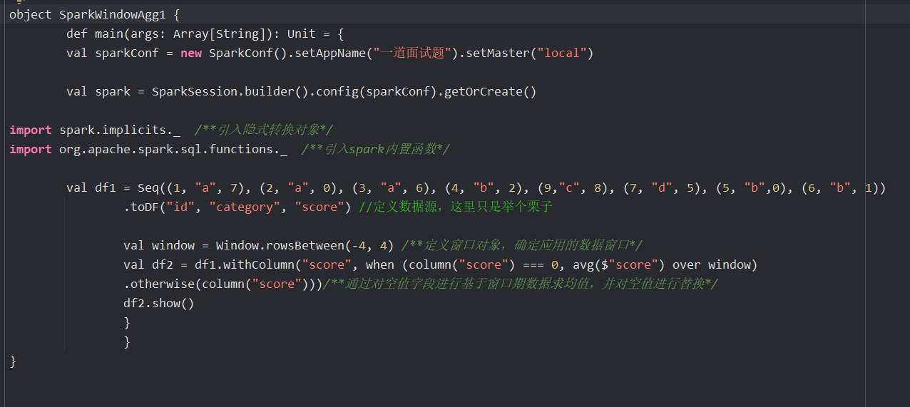

### 什么是Spark
Spark是一种基于内存的计算的开源框架,核心是RDD

---

### 什么是RDD
RDD是弹性分布式数据集,其内在与scala中的迭代器很相似,是封装数据逻辑的一个迭代器
RDD有五大特性
1. 计算函数特性,每个RDD封装着计算逻辑
2. 血缘关系特性,RDD会存储着前面RDD信息用于提高容错
3. 分区特性,在RDD上有着并行计算的能力
4. 分区器特性(可选项的)
5. 位置优先特性,有着数据不动代码动的原则(可选项的)

---

### 如何理解RDD,DataFrame,DataSet 
1. RDD是弹性分布式数据集,是Spark中最基本的数据抽象
2. DataFrame是一个分布式数据容器,每一行的固定类型为ROW,还记录了数据的结构信息(schema),性能上比RDD要高(因为执行计划得到了优化),但不安全
3. DataSet每一行的数据类型都是不确定的,dataframe为dataset的一类而已,dataset[ROW]

---

### 什么是分区
首先分区在Spark里RDD有分区,是RDD并行计算的最小单元,RDD的计算逻辑被分成多片,每片就为一个分区,分区的创建是为了更快更高效的完成作业

### 太多分区好吗
不好,因为一个分区代表一个任务,调度任务也是需要时间的所以也会影响效率或者造成资源浪费

### 太少分区好吗
不好,因为分区太少会导致每个任务的数据量增大,对内存的要求就变高,并行度也会相应减少,效率也会低

---

### 什么是分区器
首先Spark分区器只能用于keyvalue形式中的RDD
分区器描述的就是RDD的数据的分区分布规则,也决定了RDD的分区数量
最常用的为Hashpartitioner分区器
另外还有Rangepartitioner分区器(使用到了水塘抽样算法)
还有就是自定义的分区器, 只需要继承partitioner 重写方法就行

###手写一个分区器

---

### Spark Yarn模式下的client提交方式
1. 客户端提交了submit进程并向RM请求启动AM,并在客户端启动一个Driver
2. RM收到请求后随机在一台NM启动AM
3. AM启动后会去找RM申请一批容器用于请求启动Executor
4. RM收到请求后向AM返回一批NM节点信息
5. AM会向NM发送命令启动Executor
6. Executor进程启动后会向**Driver**反向注册，Executor全部注册完成后Driver开始执行main函数，之后执行到Action算子时，触发一个job，并根据宽依赖开始划分stage，每个stage生成对应的taskSet，之后将task分发到各个Executor上执行。

### Spark Yarn模式下的cluster提交方式
1. 客户端提交submit进程并向RM请求启动AM
2. RM收到请求后会在集群中随便找台NM启动AM(相当于Driver)
3. AM启动之后,向RM申请一批容器用于启动Executor
4. RM收到请求后,向AM返回一批NM节点信息
5. AM会向NM发送命令启动Executor
6. Executor进程启动后会向**AM**反向注册，Executor全部注册完成后AM开始执行main函数，之后执行到Action算子时，触发一个job，并根据宽依赖开始划分stage，每个stage生成对应的taskSet，之后将task分发到各个Executor上执行。

区别就在于yarn-client模式下，Driver运行在Client上，通过ApplicationMaster向RM获取资源。本地Driver负责与所有的executor container进行交互，并将最后的结果汇总，它的 AM 只是作为一个 Executor 启动器。而且 Executor启动后是与 Client 端的 Driver 进行交互的，所以主节点挂了,任务也就挂了。

---

###stage的划分过程
以行动算子的runjob方法开始提交,根据RDD的血缘关系生成DAG有向无环图,将图交给Driver端的dagScheduler方法,去根据当前job的finalRDD进行回溯算法,遇到了窄依赖就将该RDD收入到stage里,而遇到宽依赖也就是Shuffle就会从该处切开生成新的stage,在结尾的叫resultstage,其余的都是shufferMapStage

---

###reduceByKey与groupByKey的区别,哪一种更具优势?
redeceBykey按照key进行聚合,在shuffer之前有预聚合的操作
groupByKey按照key进行聚合分组,直接进行shuffer

<reduceByKey((x1,x2)=>x1+x2) x1为第一个元素,之后为每次计算的结果 x2为之后的元素>

---

###Repartition和Coalesce 的关系与区别
关系就是他们都能改变分区数
区别就是coalesce默认是不shuffer的一般用来减少分区
而repartition一般用来增加分区,增加分区就使得上游可能有一对多的情况,会产生shuffle

---

###简述下Spark中的缓存(cache和persist)与checkpoint机制，并指出两者的区别和联系 
**cache**和**persist**是将RDD数据是缓存到内存或者HDFS(磁盘)上,会被清除,不会切断依赖链
而**checkpoint**是将RDD数据是永久保存到HDFS(磁盘)上,会斩断血缘关系
一般checkpoint之前先要persist,这样执行起来会快一些

cache只会缓存到内存
persist可以有多级缓存等级

---

### 简述Spark中共享变量（广播变量和累加器）的基本原理与用途(还有闭包)
累加器是一种分布式的变量器,即分布式改变,累加器就聚合这些事件,一般用来对作业执行过程的事件进行计数,只有执行了行动算子才会触发累加器
> 

> 自定义累加器
> 

广播变量能起到减少IO,节省资源的作用,通常用来分发较大的对象.

是在Driver端的BlockManager缓存一份不可变的只读的相同的变量,
当task在运行的时候，想要使用广播变量中的数据，此时首先会在自己本地的Executor对应的BlockManager中，
尝试获取变量副本；如果本地没有，那么就从Driver远程拉取变量副本，并保存在本地的BlockManager中；
之后的这个executor上的task，都会直接使用本地的BlockManager中的副本。

>

#### 闭包是当前函数可以访问函数外部定义的变量,而在函数内改变变量不会改变外部的变量

---

###spark-sql 底层转换原理(执行过程)
1. sql语句会传入到sqlparser中生成一个未绑定元数据的逻辑执行计划
2. 接着传入到分析器中去绑定catalog元数据信息,然后返回一个DataSet
3. 再传入到优化器中去进行优化,优化有谓词下推,列裁剪,常量替换,常量累加等等
4. 传入到计划器中生成物理执行计划
5. 调用execute方法触发了里面的getByteArrayRDD,调用了两个方法
6. 一个方法是将代码进行了编译,反射,实例化,生成了一个包含stage的计算逻辑的迭代器,而另一个方法是调用了mappartitionswithindex将迭代器传入后生成了一个新的RDD。

---

### 任务生成的全过程
1. 调用SparkSubmit类，内部执行submit --> doRunMain -> 通过反射获取应用程序的主类对象 --> 执行主类的main方法。
2. 构建SparkConf和SparkContext对象，在SparkContext入口做了三件事，创建了SparkEnv对象（创建了ActorSystem对象），TaskScheduler（用来生成并发送task给Executor），DAGScheduler（用来划分Stage）。
3. ClientActor将任务信息封装到ApplicationDescription对象里并且提交给Master。
4. Master收到ClientActor提交的任务信息后，把任务信息存在内存中，然后又将任务信息放到队列中。
5. 当开始执行这个任务信息的时候，调用scheduler方法，进行资源的调度。
6. 将调度好的资源封装到LaunchExecutor并发送给对应的Worker。
7. Worker接收到Master发送过来的调度信息（LaunchExecutor）后，将信息封装成一个ExecutorRunner对象。
8. 封装成ExecutorRunner后，调用ExecutorRunner的start方法，开始启动 CoarseGrainedExecutorBackend对象。
9. Executor启动后向DriverActor进行反向注册。
10. 与DriverActor注册成功后，创建一个线程池（ThreadPool），用来执行任务。
11. 当所有的Executor注册完成后，意味着作业环境准备好了，Driver端会结束与SparkContext对象的初始化。
12. 当Driver初始化完成后（创建了sc实例），会继续执行我们提交的App的代码，当触发了Action的RDD算子时，就触发了一个job，这时就会调用DAGScheduler对象进行Stage划分。
13. DAGScheduler开始进行Stage划分。
14. 将划分好的Stage按照区域生成一个一个的task，并且封装到TaskSet对象，然后TaskSet提交到TaskScheduler。
15. TaskScheduler接收到提交过来的TaskSet，拿到一个序列化器，对TaskSet序列化，将序列化好的TaskSet封装到LaunchExecutor并提交到DriverActor。
16. 把LaunchExecutor发送到Executor上。
17. Executor接收到DriverActor发送过来的任务（LaunchExecutor），会将其封装成TaskRunner，然后从线程池中获取线程来执行TaskRunner。
18. TaskRunner拿到反序列化器，反序列化TaskSet，然后执行App代码，也就是对RDD分区上执行的算子和自定义函数。

---

###为什么scala的迭代器上的map/flatmap...算子，具有lazy执行的特性？
> scala迭代器里的那些转换算子底层并没有调用HashNext和Next方法,而是根据逻辑创建了一个新的迭代器

###为什么rdd的transformation算子，具有lazy执行的特性？
> 因为RDD的转换算子底层没有触发阶段划分,job提交或者task提交的动作,而只是根据逻辑创健了一个新的RDD实例返回

###为什么说rdd中并没有真正存储数据？而触发rdd上的行动算子时又能拿到计算结果是为什么？
> 因为RDD存储的是里面的compute方法套了前一个rdd的转换逻辑,而行动算子触发了runjob,会追溯到初代RDD获取数据的位置再根据计算逻辑处理数据得到结果

###闭包引用变量和广播变量的区别
> 闭包引用变量会跟着task一起序列化,就会每个task都有一份数据
> 而广播变量就将变量放到Driver的brokermanager,供task去读取,且有BT协议,在Task中可以互相传播

###execute端是什么样的角色
> execute是一个计算任务的进程,收到Dviver端调度过来的task放到线程池里去运行

###Ordering的解释
> Ordering类似于Java中的Comparator,提供一个第三方的比较器用来自定义比较两个对象的大小

###RDD的分区数是如何决定的
> 1.参数指定 2.根据父类RDD的reduceTask数量 3.HDFS切片数

###为什么需要划分Stage?
> 因为一个job任务中可能会有大量的宽窄依赖出现,划分stage就是让一些任务能都是窄依赖然后去并行的去执行任务,提高效率

###spark做缓存时候缓存在哪里
>在executor的内存里

### map 和 mappartition 算子的区别
1. map是对RDD的所有元素进行操作 更细粒度
2. mappartition是将函数作用到分区级别,也就是对所有RDD分区拿着迭代器去进行操作 但可能会引发OOM(内存溢出)
所以如果内存充裕的情况下用mappartition 

---

## Spark中的数据倾斜问题和解决的方法

### 数据倾斜是如何造成的?
1. map过程产生大量对象导致内存溢出
2. shuffle后内存溢出

### 如何定位Spark数据倾斜问题?
（1）通过Spark Web UI去查看task执行情况，查看到底是在哪个stage阶段下卡住了，然后再去我们的程序代码中，查看涉及到shuffle操作算子有哪些；
（2）如果出现了OOM情况，可以通过去Yarn的日志中进行定位查看，看看是执行到第几个stage，哪个stage下的哪个task执行得特别慢，定位到具体的stage之后，再到程序代码中定位到具体发生数据倾斜的算子是哪个；

### Spark解决数据倾斜的方案
数据倾斜我们一般分为简单倾斜和复杂倾斜
1. 简单倾斜也就是数据源分布不均匀又或者是过滤操作之后导致的分区数据量大小不一致
一般可以采用repatition,coalesce函数减少分区来实现数据的重新分区,又或者是spark3.0之后有了AQE机制,也就是动态优化机制,会将计划树拆分成多个QueryStages,然后收集shuffle数据的信息,将QueryStage执行计划修改为更好的执行计划然后再转DAG去执行stage
2. 复杂倾斜也就是业务逻辑上会有字段的聚合运算导致的数据不均匀,比如说重庆民宿会比其他地方多
这时候会有几种解决办法
   1. 减少spark任务的并行度,减少executor数量,但增加executor内存和执行核数,去让任务更加多资源运算，而且不会造成资源的浪费.
   2. 提高数据的处理频率,降低单次数据处理量,批次投入到partition中,这样数据量就会少一些只是任务量多而已
   3. 两阶段聚合（局部聚合+全局聚合）
将原本相同的key通过添加随机前缀的方式，变成多个不同的key，就可以让原本被一个task处理的数据分散到多个task上去做局部聚合，这样就解决了单个task处理数据量过多的问题。接着去除掉随机前缀，再次进行一次全局聚合，就可以得到最终的结果；

---

### Spark 3.0 AQE自适应查询执行机制
1. 自动分区合并,shuffle后如果task数据分布层次不齐,AQE就自动合并过小的分区
2. join策略调整 如果某张表过滤之后尺寸小于广播变量阈值,这张表就会降级为broadcast joins ,也就是把这张表给广播了
3. 自动倾斜处理 自动拆分reduce阶段过大的数据分区,降低单个reduce task的工作负载

### Spark 3.0 DPP动态分区裁剪机制
要使用DPP的前提条件为
1. 那张事实表必须是分区表
2. 只支持等值的join 也就是left join right join inner join 这种
3. 维度表过滤之后的数据需要小于广播阈值 

然后他就会根据关联关系去只扫描满足条件的字段,减少数据扫描量

---
### 如果Application在没有获得足够的资源，job就开始执行了，可能会导致什么什么问题发生?
会导致执行该job时候集群资源不足，只分配了部分Executor，job就开始执行task；
所以应该申请完所有的资源再执行job
需要将

spark.scheduler.maxRegisteredResourcesWaitingTime 这个参数设置的大一些
在执行前最大等待申请资源的时间，默认30s。 

spark.scheduler.minRegisteredResourcesRatio 这个设置为 1
实际注册的资源数占预期需要的资源数的比例，默认0.8
但是应该结合实际考虑否则很容易出现长时间分配不到资源，job一直不能运行的情况。

---
### MR和spark的区别
1. MR的map端中间结果会落到磁盘上,而spark是存到内存中
2. MR是多进程单线程,Spark是多进程多线程
3. MR运行在yarn上,spark有local standAlone yarn模式
4. spark容错高,因为RDD有依赖关系实现计算流程的重建,而mapreduce就只能重新计算
5. spark的API比MR要更多一些,spark更灵活
---

### MR和spark的shuffle有什么区别
1. 功能上,MR的shuffle和sparkshuffle没什么区别,都是map端的数据分区，sparkshuffle其实就是MR的基础上做了调优，对排序和合并逻辑做了优化
2. 但MapReduce它必须将所有的数据都写入本地磁盘文件以后，才能启动reduce操作，来拉取数据。为什么？因为mapreduce要实现默认的根据key的排序！肯定得写完所有数据，才能排序，然后reduce端来拉取。

但是Spark不需要，spark默认情况下，是不会对数据进行排序的。因此ShuffleMapTask每写入一点数据，下游就可以拉取一点数据，然后在本地执行我们定义的聚合函数和算子，进行计算。

---

### 介绍一下Spark的shuffle
在之前的版本默认是Hashshuffer,现在的3.0spark中shuffle有三种
第一种为BypassMergeSortShuffle,要求map端不能聚合且分区数不能大于200
第二种为unsafeShuffle,要求必须能序列化且不能map端聚合以及reduce不得多于2^24个
第三种为sortshuffle,前两种都不满足就会使用这一个   

---

### Spark 为什么比 MapReduce 快?
Spark 是基于内存计算，MapReduce 是基于磁盘运算，所以速度快

---

### spark sql 和 hive sql的区别
spark的计算引擎就是spark本身,而hive计算引擎是MR,且sparksql有很多优化在opitimizer里.

---

### spark内存管理机制
spark分为堆内内存和堆外内存
1. 堆内内存有个动态占用机制,执行内存可以和缓存内存互相分享内存,默认统一内存占百分之六十,other内存占百分之四十用来放自定义的数据结构和spark的元数据信息,还有300M的预留区
2. 堆外内存只有两种用途,一种是storage存RDD数据,一种是execution就是存的序列化,也是动态占用.

--- 

### worker 和 executor的区别  
worker是承载executor的服务器/在yarn上叫nodemanager,executor是一个容器装载着task,是spark计算任务的进程

---

### spark做 --> 如果当前行数据的某个字段值为空，那么需要根据上下n行(n=4)数据中该字段值的平均值来进行填充

---

### spark算子有哪些
1. 转换算子 如 map groupByKey reducebykey aggregatebykey sortbykey 等
2. 行动算子 如 reduce foreach 等等

---

### groupByKey reducebykey aggregatebykey
groupByKey直接进行shuffle操作，数据量大的时候速度较慢。

reduceByKey、aggregateByKey在shuffle之前可能会先进行聚合，聚合后的数据再进行shuffle，这样一来进行shuffle的数据会变少，速度会快。

reduceByKey、aggregateByKey的区别是
前者不同partition以及partition之间的聚合操作是一样的
而后者可以指定两种操作来对应于partition之间和partition内部不同的聚合操作，并且aggregateByKey可以指定初始值。

---

### spark的共享变量有什么
广播变量和累加器