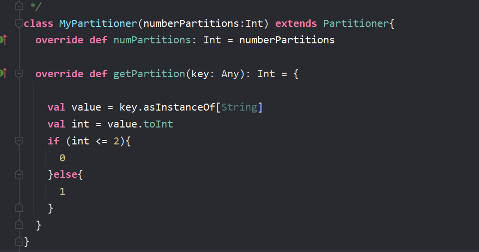
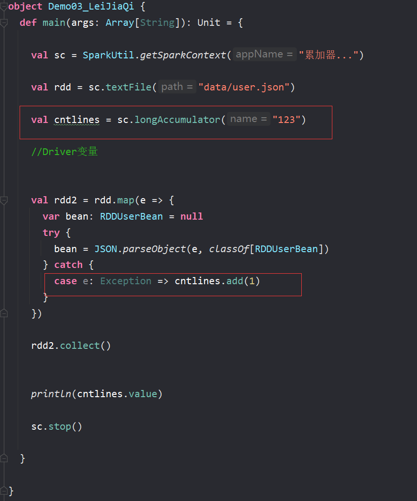
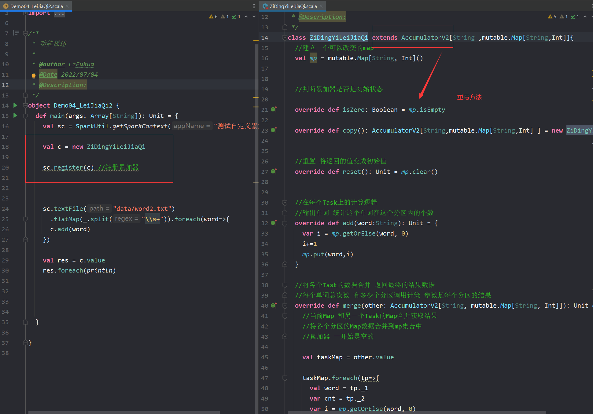
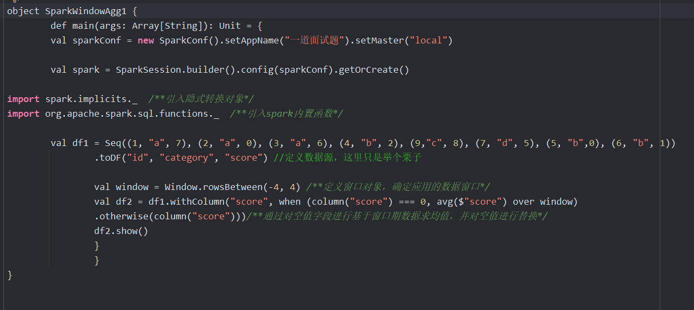

### 什么是Spark
Spark是一种基于内存的计算的开源框架计算引擎,核心是RDD

---
### Spark组成部分
1. Driver
它会运行客户端写好的main方法，并且它会创建sparkcontext对象，该对象是所有spark程序的执行入口。
2. Application
它就是一个应用程序，它包括了Driver端的代码逻辑和任务在执行的时候需要的资源信息。
3. Master
它是整个spark集群的老大，它负责资源的分配。
4. Worker
它是整个spark集群的小弟，它负责任务的计算节点
它是一个进程，它会在worker节点上启动对应的executor进程
5. blockManager(在nodemanager/每个节点里面)
管理Spark运行时候的读写

### 什么是RDD
RDD是弹性分布式数据集,其内在与scala中的迭代器很相似,是封装数据逻辑的一个迭代器
RDD有五大特性
1. 计算函数特性,每个RDD封装着计算逻辑
2. 血缘关系特性,RDD会存储着前面RDD信息用于提高容错
3. 分区特性,在RDD上有着并行计算的能力
4. 分区器特性(可选项的) 1.HashPartitioner 2. RangePartitioner  
5. 位置优先特性,有着数据不动代码动的原则(可选项的) 
spark任务在调度的时候会优先考虑存有数据的节点开启计算任务，减少数据的网络传输，提升计算效率

---

### RDD弹性体现在哪
我觉得他的弹性体现在
1. 首先他会优先把数据放在内存,存不了就会放到磁盘里,然后自动去优化计算和存放策略
2. 然后又有血缘关系
3. 而且还有checkpoint和cache,persist这样的持久化机制来保证容错
4. 以及调度的时候可以和主机器无关,用cluster模式就行
5. 还能把计算逻辑分片去运行

### 如何理解RDD,DataFrame,DataSet 
1. RDD是整个Spark平台的一个逻辑基础,适用于各类的数据源
2. 而DATAframe只针对结构化数据源的一个抽象数据，就是它必须去指定数据集的Schema，他用来负责处理结构化数据源的，就是倾向于大规模数据分析
3. 所以RDD是分布式的java对象的集合，而dataFrame是row对象的集合
4. DataFrame本质上是一个分布式的数据表,里面每个元素就不是泛型的对象了,而是固定类型ROW,他背后的思想就是处理大量结构化的数据,提供了select fliter这种操作.
5. DataSet每一行的数据类型都是不确定的,dataframe为dataset的一类而已,dataset[ROW]

RDD的优点
编译时候及时发现报错
具有面向对象的编程风格
RDD的缺点
数据序列化和反序列化性能开销大

DataFrame优点
就只需要把数据的内容本身序列化就可以，结构信息是可以省略掉的，所以IO数据量会减少，序列化和反序列化的开销也不会很大
dataframe缺点
编译时候类型会不安全，也就是运行的时候才会发现错误，编译的时候不会
而且不在具有面向对象编程的风格

---

### 什么是分区
首先分区在Spark里它是RDD有分区,是RDD并行计算的最小单元,RDD的计算逻辑被分成多片,每片就为一个分区,分区的目的是为了更快更高效的完成作业

### 太多分区好吗
不好,因为一个分区代表一个任务,调度任务也是需要时间的所以也会影响效率或者造成资源浪费

### 太少分区好吗
不好,因为分区太少会导致每个任务的数据量增大,对内存的要求就变高,并行度也会相应减少,效率也会低

---

### 什么是分区器
首先Spark分区器只能用于keyvalue形式中的RDD
分区器描述的就是RDD的数据的分区分布规则,也决定了RDD的分区数量
最常用的为Hashpartitioner分区器
另外还有Rangepartitioner分区器(使用到了水塘抽样算法)
还有就是自定义的分区器, 只需要继承partitioner 重写方法就行

###手写一个分区器

---

### Spark Yarn模式下的client提交方式
1. 客户端提交了submit进程并向RM请求启动AM,并在客户端启动一个Driver
2. RM收到请求后随机在一台NM启动AM
3. AM启动后会去找RM申请一批容器用于请求启动Executor
4. RM收到请求后向AM返回一批NM节点信息
5. AM会向NM发送命令启动Executor
6. Executor进程启动后会向**Driver**反向注册，Executor全部注册完成后Driver开始执行main函数，之后执行到Action算子时，触发一个job，并根据宽依赖开始划分stage，每个stage生成对应的taskSet，之后将task分发到各个Executor上执行。

### Spark Yarn模式下的cluster提交方式(spark工作原理)
1. 客户端提交submit进程并向RM请求启动AM
2. RM收到请求后会在集群中随便找台NM启动AM(相当于Driver)
3. AM启动之后,向RM申请一批容器用于启动Executor
4. RM收到请求后,向AM返回一批NM节点信息
5. AM会向NM发送命令启动Executor
6. Executor进程启动后会向**AM**反向注册，Executor全部注册完成后AM开始执行main函数，之后执行到Action算子时，触发一个job，并根据宽依赖开始划分stage，每个stage生成对应的taskSet，之后将task分发到各个Executor上执行。

区别就在于yarn-client模式下，Driver运行在Client上，通过ApplicationMaster向RM获取资源。本地Driver负责与所有的executor container进行交互，并将最后的结果汇总，它的 AM 只是作为一个 Executor 启动器。而且 Executor启动后是与 Client 端的 Driver 进行交互的，所以主节点挂了,任务也就挂了。

---

### 为什么需要划分Stage?
因为一个job任务中可能会有大量的宽窄依赖出现,划分stage就是让一些任务能都是窄依赖然后去并行的去执行任务,提高效率

### Spark stage划分过程
以行动算子的runjob方法开始提交,根据RDD的血缘关系生成DAG有向无环图,将图交给Driver端的dagScheduler方法,也就是去根据当前job的finalRDD进行回溯算法,遇到了窄依赖就将该RDD收入到stage里,而遇到宽依赖也就是Shuffle就会从该处切开生成新的stage,那在结尾的叫resultstage,其余的都是shufferMapStage

### task分发过程
1. 打散可用的executors:这样就避免了把task分配少数几个executor里面
2. 对所有处于等待状态的taskSet进行排序:排序的目的是让优先级更高的taskSet更优先的被调度
3. 结合taskSet的排序把tasks分配给executors

### Shuffle writer 和 reader 
Shuffle Write的处理逻辑会放到该ShuffleMapStage的最后，因为rdd.iterator()将调用compute方法，并且递归调用父RDD的compute方法

因为Spark以宽窄依赖来划分Stage，所以该Stage的final RDD每输出一个 record 就将其分区并持久化
然后就是sparkwriter目前版本有三种嘛

### 介绍一下Spark的shuffle(writer)
在之前的版本默认是Hashshuffer,但是会造成很多的小文件.
所以更新之后现在的spark中shuffle有三种
1. 第一种为BypassMergeSortShuffle要求map端没有聚合操作且分区数不能大于200

**(而该机制与普通 SortShuffleManager 运行机制的不同在于：磁盘写机制不同、不会进行排序。启用该机制的最大好处在于，Shuffle Write 过程中，不需要进行数据的排序操作，也就节省掉了这部分的性能开销)**

1. 第二种为unsafeShuffle,要求必须能序列化且map端没有聚合操作以及reduce不能大于一个很大的值具体多少忘了(2^24)

2. 第三种为sortshuffle,前两种都不满足就会使用这一个

### shuffle reader 
shuffle reader 的话就是碰到了HadoopRDD和ShuffledRDD，则会在compute方法中触发读取。如果碰到了MapPartitionsRDD，则会继续调用前一个RDD的迭代器，继续前一个RDD的compute方法。直到追溯到一个Task第一个RDD，然后才会触发读取文件数据。
然后具体的操作就是寻址+拉取

---

### 任务生成的全过程
1. 调用SparkSubmit类，内部执行submit --> doRunMain -> 通过反射获取应用程序的主类对象 --> 执行主类的main方法。
2. 构建SparkConf和SparkContext对象，在SparkContext入口做了三件事，创建了SparkEnv，TaskScheduler，DAGScheduler（用来划分Stage）。
3. ClientActor将任务信息封装到ApplicationDescription对象里并且提交给Master。
4. Master收到ClientActor提交的任务信息后，把任务信息存在内存中，然后又将任务信息放到队列中。
5. 当开始执行这个任务信息的时候，调用scheduler方法，进行资源的调度。
6. 将调度好的资源封装到LaunchExecutor并发送给对应的Worker。
7. Worker接收到Master发送过来的调度信息（LaunchExecutor）后，将信息封装成一个ExecutorRunner对象。
8. 封装成ExecutorRunner后，调用ExecutorRunner的start方法，开始启动 CoarseGrainedExecutorBackend对象。
9. Executor启动后向DriverActor进行反向注册。
10. 与DriverActor注册成功后，创建一个线程池（ThreadPool），用来执行任务。
11. 当所有的Executor注册完成后，意味着作业环境准备好了，Driver端会结束与SparkContext对象的初始化。
12. 当Driver初始化完成后（创建了sc实例），会继续执行我们提交的App的代码，当触发了Action的RDD算子时，就触发了一个job，这时就会调用DAGScheduler对象进行Stage划分。
13. DAGScheduler开始进行Stage划分。
14. 将划分好的Stage按照区域生成一个一个的task，并且封装到TaskSet对象，然后TaskSet提交到TaskScheduler。
15. TaskScheduler接收到提交过来的TaskSet，拿到一个序列化器，对TaskSet序列化，将序列化好的TaskSet封装到LaunchExecutor并提交到DriverActor。
16. 把LaunchExecutor发送到Executor上。
17. Executor接收到DriverActor发送过来的任务（LaunchExecutor），会将其封装成TaskRunner，然后从线程池中获取线程来执行TaskRunner。
18. TaskRunner拿到反序列化器，反序列化TaskSet，然后执行App代码，也就是对RDD分区上执行的算子和自定义函数。

---

### reduceByKey与groupByKey的区别,哪一种更具优势?
redeceBykey按照key进行聚合,在shuffer之前有预聚合的操作
groupByKey按照key进行聚合分组,直接进行shuffer

有点像hive的mapjoin 只要不是会让最终业务逻辑出错的都可以用reducebykey，比如平均值这种就不太行

<reduceByKey((x1,x2)=>x1+x2) x1为第一个元素,之后为每次计算的结果 x2为之后的元素>

---

### Repartition和Coalesce 的关系与区别
关系就是他们都能改变分区数
区别就是coalesce默认是不shuffer的一般用来减少分区
而repartition一般用来增加分区,增加分区就使得上游可能有一对多的情况,会产生shuffle

---

### 简述下Spark中的缓存(cache和persist)与checkpoint机制，并指出两者的区别和联系 
cache的作用是对RDD的逻辑进行缓存,等到遇到了有重复用到这个RDD的时候就会拿缓存好的RDD出来也就不用重新计算了.
checkpoint更像是一种容错机制,为了保证任务挂掉后需要重新计算带来的麻烦.

**cache**和**persist**是将RDD数据是缓存到内存或者HDFS(磁盘)上,它是会被清除的

而**checkpoint**是将RDD数据是永久保存到HDFS(磁盘)上,会斩断血缘关系
一般checkpoint之前先要persist,这样执行起来会快一些

cache只会缓存到内存
persist可以有多级缓存等级

注意的是:如果这个缓存分给了两个RDD使用的话,是会把对象内属性引用的值改变的,就会造成两种不同的结果
且cache后面接其他算子 就起不到缓存应该有的效果 (它不是行动算子)  
### spark做缓存时候缓存在哪里
在executor的内存里

---

### 简述Spark中共享变量（广播变量和累加器）的基本原理与用途(还有闭包)
累加器是一种分布式的变量器,累加器就聚合这些事件,一般用来对作业执行过程的事件进行计数，比如对出错次数的统计
只有执行了行动算子才会触发累加器
> 

> 自定义累加器
> 

广播变量能起到减少IO,节省资源的作用,通常用来分发较大的对象.

### 广播变量原理
在Driver端的BlockManager缓存一份不可变的只读的数据集,
然后当task在运行的时候，想要使用广播变量中的数据，如果本地没有，那么就从Driver远程拉取变量副本，并保存在本地的BlockManager内存里中；
之后的这个executor上的task，都会直接使用本地的BlockManager中的副本。

>

### 闭包引用变量和广播变量的区别
闭包引用变量会跟着task一起序列化,就会每个task都有一份数据
而广播变量就将变量放到Driver的brokermanager,供task去读取,而且具有BT协议,在Task中可以互相传播

---

### spark-SQL 底层转换原理(执行过程)
1. sql语句会传入到sqlparser中生成一个未绑定元数据的逻辑执行计划
2. 接着传入到分析器中去绑定catalog元数据信息(table信息,列信息,展开view视图逻辑),然后返回一个DataSet
3. 再传入到优化器中去进行优化,优化有谓词下推,列裁剪,常量替换,常量累加等等
4. 传入到计划器中生成物理执行计划(join aggregate类型选择)
5. 调用execute方法触发了里面的getByteArrayRDD,调用了两个方法
6. 一个方法是将代码进行了编译,反射,实例化,生成了一个包含stage的计算逻辑的迭代器,而另一个方法是调用了mappartitionswithindex将迭代器传入后生成了一个新的RDD。

---

### 为什么scala的迭代器上的map/flatmap...算子，没具有lazy执行的特性？
scala迭代器里的那些转换算子底层并没有调用HashNext和Next方法,而是根据逻辑创建了一个新的迭代器

### 为什么rdd的transformation算子，具有lazy执行的特性？
因为RDD的有些转换算子底层没有触发stage划分或者是job提交或者task提交的动作,而只是根据逻辑创健了一个新的RDD实例返回

### 为什么说rdd中并没有真正存储数据？而触发rdd上的行动算子时又能拿到计算结果是为什么？
因为RDD存储的是里面的compute方法套了前一个rdd的转换逻辑,而行动算子触发了runjob,会追溯到初代RDD获取数据的位置再根据计算逻辑处理数据得到结果

### execute端是什么样的角色-
execute是一个计算任务的进程,它收到Dviver端调度过来的task放到线程池里去运行

### Ordering的解释
Ordering类似于Java中的Comparator,提供一个第三方的比较器用来自定义比较两个对象的大小

### RDD的分区数是如何决定的(partition的数目)
1. 参数指定 
2. 根据父类RDD的reduceTask数量 
3. InputSplit的切片数

### spark宽依赖和窄依赖的区别
窄依赖：就是父RDD所发的牌只给下游一个子RDD
宽依赖：父RDD给下游多个子RDD发牌

### Spark join一定会产生shuffle嘛?
当两个rdd分区数和分区方式一样时做join就不会产生shuffle,也就是没有发生宽依赖

### spark job数 stage数 task数量由什么决定
1. job数由行动算子决定的,也就是runjob
2. stage数是由宽依赖决定的
3. task数是由RDD的分区数决定的,Executor每个核同时只能执行一个Task
(也就是inputsplit分片)
4. task并行度: Executor个数 * 单个Executor所设置的核数

### map 和 mappartition 算子的区别
1. map是对RDD的所有元素进行操作 更细粒度
2. mappartition是将函数作用到分区级别,也就是对所有RDD分区拿着迭代器去进行操作 但可能会引发OOM(内存溢出)
所以如果内存充裕的情况下用mappartition 

---

## Spark中的数据倾斜问题和解决的方法

### 数据倾斜是如何造成的?
就是任务调度过程中,一般是shuffle导致的一个分区的任务处理量特别多,而别的没有那么多然后这样就总体来看spark整个作业看起来就会特别的慢

### 如何定位Spark数据倾斜问题?
通过Spark Web UI去查看task执行情况，查看到底是在哪个stage阶段下卡住了，在那个Shuffle read Size那里会特别大然后比较明显的能,然后再去我们的程序代码中，查看涉及到shuffle操作算子有哪些；

### Spark解决数据倾斜的方案
数据倾斜我们一般分为简单倾斜和复杂倾斜
1. 简单倾斜也就是数据源它的分布不均匀又或者是fliter过滤操作之后导致的分区数据量大小不一致的嘛
一般可以采用coalesce函数减少分区来实现数据的重新分区,又或者是spark3.0之后有了AQE机制,也就是动态优化机制,会将计划树拆分成多个QueryStages,然后收集shuffle数据的信息,将QueryStage执行计划修改为更好的执行计划然后再转DAG去执行stage
2. 复杂倾斜也就是业务逻辑上会有字段的聚合运算导致的数据不均匀,比如说民宿在全国来说也就北京上海重庆广州比较多
这时候会有分情况
   1. 比如我们会去增加shuffle reducetask的数量，把原来分配给一个task的多个key分配给多个task，但实际效果是有限的，因为可能针对某个key无论增加多少他都不会变
   2. 那我们可能会用到自定义分区器去代替默认的hashpartitioner分区器，尽量的让不同的key均匀分配嘛，但是这个其实和刚刚调整并行度是类似。
   3. 或者就把reduce join 变成map join，但这种就只适用于一个大表一个小表的情况
   4. 两阶段聚合（局部聚合+全局聚合）
我们就将原来相同的key通过添加随机前缀的方式，变成多个不同的key，就可以让原本被一个task处理的数据分散到多个task上去做局部聚合，这样就解决了单个task处理数据量过多的问题。接着去除掉随机前缀，再次进行一次全局聚合，就可以得到最终的结果；

---

### Spark 3.0 AQE自适应查询执行机制
1. 自动分区合并,shuffle后如果task数据分布层次不齐,AQE就自动合并过小的分区
2. join策略调整 如果某张表过滤之后尺寸小于广播变量阈值,这张表就会降级为broadcast joins ,也就是把这张表给广播了
3. 自动倾斜处理 自动拆分reduce阶段过大的数据分区,降低单个reduce task的工作负载

### Spark 3.0 DPP动态分区裁剪机制
要使用DPP的前提条件为
1. 那张事实表必须是分区表
2. 只支持等值的join 也就是left join right join inner join 这种
3. 维度表过滤之后的数据需要小于广播阈值 

然后他就会根据关联关系去只扫描满足条件的字段,减少数据扫描量

---
### 如果Application在没有获得足够的资源，job就开始执行了，可能会导致什么什么问题发生?
会导致执行该job时候集群资源不足，只分配了部分Executor，job就开始执行task；
所以应该申请完所有的资源再执行job
需要将

spark.scheduler.maxRegisteredResourcesWaitingTime 这个参数设置的大一些
在执行前最大等待申请资源的时间，默认30s。 

spark.scheduler.minRegisteredResourcesRatio 这个设置为 1
实际注册的资源数占预期需要的资源数的比例，默认0.8
但是应该结合实际考虑否则很容易出现长时间分配不到资源，job一直不能运行的情况。

---

### MR和spark的区别
1. MR的map端中间结果会落到磁盘上,而spark是存到内存中
2. MR是多进程单线程,Spark是多进程多线程
3. MR运行在yarn上,spark有local standAlone yarn模式
4. spark容错高,因为RDD有依赖关系实现计算流程的重建,而mapreduce就只能重新计算
5. spark的API比MR要更多一些,spark更灵活
---

### MR和spark的shuffle有什么区别
1. 功能上,MR的shuffle和sparkshuffle没什么区别,都是map端做数据分区，sparkshuffle其实就是MR的基础上做了调优，我记得是对排序和合并逻辑做了优化
2. 但MapReduce它必须将所有的数据都写入本地磁盘文件以后，才能启动reduce操作，来拉取数据。为什么？因为mapreduce要实现默认的根据key的排序！肯定得写完所有数据，才能排序，然后reduce端来拉取。

但是Spark不需要，spark默认情况下，是不会对数据进行排序的。因此ShuffleMapTask每写入一点数据，下游就可以拉取一点数据，然后在本地执行我们定义的聚合函数和算子，进行计算。

### Spark 为什么比 MapReduce 快?
Spark 是基于内存计算，MapReduce 是基于磁盘运算，所以速度快

---

### spark sql 和 hive sql的区别
spark sql有个Catalyst优化器嘛,会再语法树提供一种转换方法,会做谓词下推列裁剪常量累加这种sql优化
语法上面比如获取行号 hive窗口函数可以在over后面不写partition by orderby ,但sparksql必须写.

---

### spark内存管理机制
spark分为堆内内存和堆外内存
1. 堆内内存有个动态占用机制,执行内存可以和缓存内存互相分享内存,默认统一内存占百分之六十,other内存占百分之四十用来放自定义的数据结构和spark的元数据信息,还有300M的预留区
2. 堆外内存只有两种用途,一种是storage存RDD数据,一种是execution就是存的序列化,也是动态占用.

--- 

### worker 和 executor的区别  
worker是承载executor的服务器/在yarn上叫nodemanager,executor是一个容器装载着task,是spark计算任务的进程

---

### spark做 --> 如果当前行数据的某个字段值为空，那么需要根据上下n行(n=4)数据中该字段值的平均值来进行填充

---

### spark算子有哪些
1. 转换算子 如 map flatmap mappartition groupByKey reducebykey aggregatebykey sortbykey 等
2. 行动算子 如 reduce foreach 等等

1. 窄依赖的函数有：map, filter, union, join(父RDD是hash-partitioned), mapPartitions, mapValuesit
2. 宽依赖的函数有：groupByKey, join(父RDD不是hash-partitioned),partitionBy

---

### groupByKey reducebykey aggregatebykey
首先他们都是分组的功能
groupByKey直接进行shuffle操作，数据量大的时候速度较慢。
reduceByKey、aggregateByKey在shuffle之前可能会先进行聚合，聚合后的数据再进行shuffle，这样一来进行shuffle的数据会变少，速度会快。

reduceByKey、aggregateByKey的区别是
前者不同partition以及partition之间的聚合操作是一样的
而后者可以指定两种操作来对应于partition之间和partition内部不同的聚合操作，并且aggregateByKey可以指定初始值。

### map 和 flatmap 区别
map可以对一个集合中的每一个元素进行操作，适用于只有一个集合的场景，返回的是对每一个元素的进行的转换之后的操作

flatMap是每个输入的元素可以被映射为0个或者多个输出的元素，返回的是一个可迭代的集合

---

### spark调优(spark优化)
1. 从性能方面的话 
   1. 分配资源给任务量大的
   2. 调节并行度
   3. 用广播变量
   4. persist量级大的RDD
2. 然后就是算子的调优
   1. mappartition解决数据量小一些的
   2. filter之后减少分区数据量
   3. 如果不影响后续结果的话用reduceybykey替换groupbykey 

### sparksql 工作中出现的问题
1. spark对于部分orc格式的的hive表会有读取表数据为空的情况
这个时候我们要去修改参数 有个metastoreOrc=true

2. hive有外部表用decimal的格式做的 然后把数据导入进去后以parquet格式保存到这张表里面 
用spark sql 查询会报出空指针的异常  问题就在于decimal格式也要一样 不可以一个精度是6一个精度是10 

3. 还有就是两个decimal类型的相乘为null值 那就自己做一个udf两个decimal相除的函数去实现

### spark join有几种 
三种 
broadcast join 
广播的表首先被collect到driver段，然后被冗余分发到每个executor上

Shuffle Hash Join  大批量的数据划分成n份较小的数据集进行并行计算
对两张表分别按照join keys进行重分区，即shuffle，目的是为了让有相同join keys值的记录分到对应的分区中
对对应分区中的数据进行join，此处先将小表分区构造为一张hash表，然后根据大表分区中记录的join keys值拿出来进行匹配

Sort Merge Join 大表对大表
将两张表按照join keys进行了重新shuffle，保证join keys值相同的记录会被分在相应的分区。分区后对每个分区内的数据进行排序，排序后再对相应的分区内的记录进行连接

因为两个序列都是有序的，从头遍历，碰到key相同的就输出；如果不同，左边小就继续取左边，反之取右边(即用即取即丢)

### Spark TaskScheduler任务调度规则以及Task的优先级是怎么定义的
1. FIFO调度规则 计算优先级的数字越小,优先级越高 优先级相同的话就看stage的编号
   
2. Fair调度规则 看最小资源的Task 和占用权重资源的比例还有名字

### spark参数设置
1. num-executors  线程数：一般设置在50-100之间，必须设置，不然默认启动的executor非常少，不能充分利用集群资源，运行速度慢
2. executor-memory 线程内存：参考值4g-8g,num-executor乘以executor-memory不能超过队列最大内存，申请的资源最好不要超过最大内存的1/3-1/2
3. executor-cores 线程CPU core数量：core越多，task线程就能快速的分配，参考值2-4，num-executor*executor-cores的1/3-1/2
 
1. --spark-submit spark提交
2. --queue spark 在spark队列
3. --master yarn 在yarn节点提交
4. --deploy-mode client 选择client模型，还是cluster模式；在同一个节点用client,在不同的节点用cluster
5. --executor-memory=4G 线程内存：参考值4g-8g,num-executor乘以executor-memory不能超过队列最大内存，申请的资源最好不要超过最大内存的1/3-1/2
6. --conf spark.dynamicAllocation.enabled=true 是否启动动态资源分配
7. --executor-cores 2 线程CPU core数量：core越多，task线程就能快速的分配，参考值2-4，num-executor*executor-cores的1/3-1/2
8. --conf spark.dynamicAllocation.minExecutors=4 执行器最少数量
9. --conf spark.dynamicAllocation.maxExecutors=10 执行器最大数量
10. --conf spark.dynamicAllocation.initialExecutors=4 若动态分配为true,执行器的初始数量
11. --conf spark.executor.memoryOverhead=2g 堆外内存：处理大数据的时候，这里都会出现问题，导致spark作业反复崩溃，无法运行；此时就去调节这个参数，到至少1G（1024M），甚至说2G、4G）
12. --conf spark.speculation=true 推测执行：在接入kafaka的时候不能使用，需要考虑情景
13. --conf spark.shuffle.service.enabled=true 提升shuffle计算性能

### Spark读取Zip文件
new 一个ZipinputStream  

### spark and hive 
【spark on hive 】
hive只作为存储角色，spark 负责sql解析优化，底层运行的还是sparkRDD
具体可以理解为spark通过sparkSQL使用hive语句操作hive表，底层运行的还是sparkRDD
步骤如下：

1.通过sparkSQL，加载Hive的配置文件，获取Hive的元数据信息
2.获取到Hive的元数据信息之后可以拿到Hive表的数据
3.通过sparkSQL来操作Hive表中的数据

【hive on spark】
hive既作为存储又负责sql的解析优化，spark负责执行
这里Hive的执行引擎变成了spark，不再是MR。
这个实现较为麻烦，必须重新编译spark并导入相关jar包
