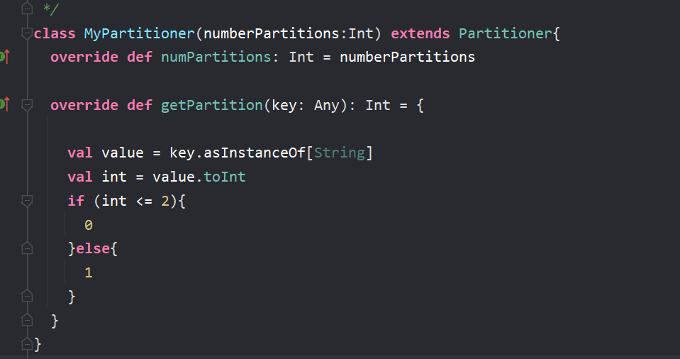
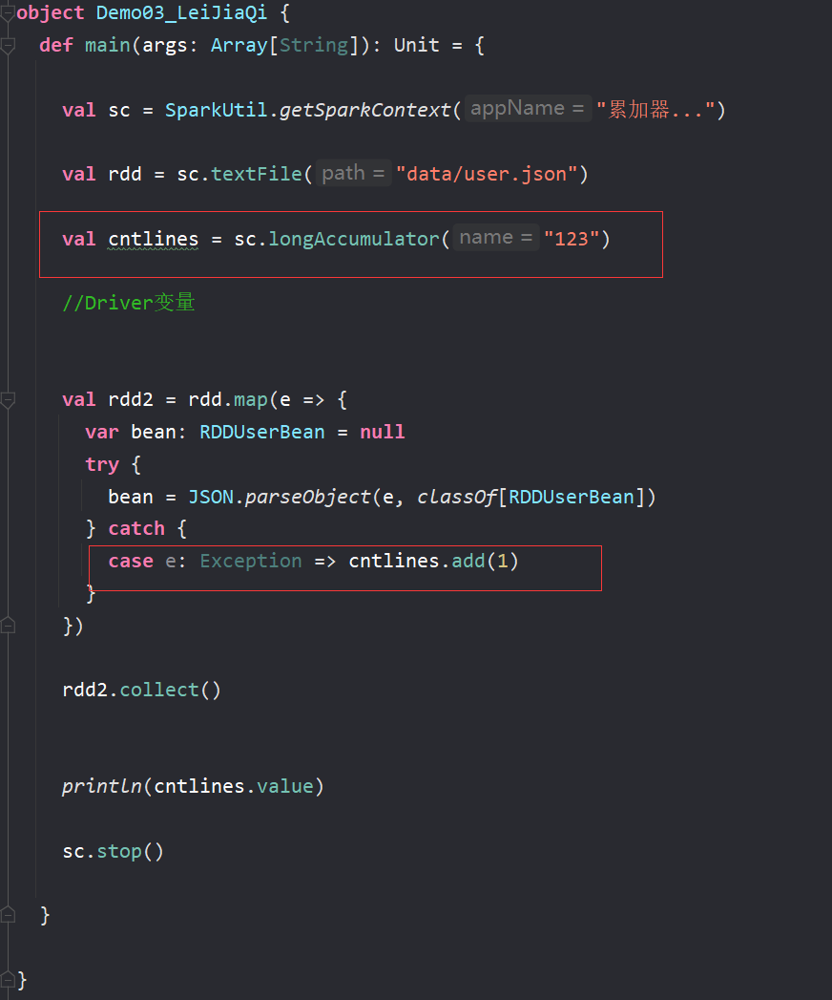
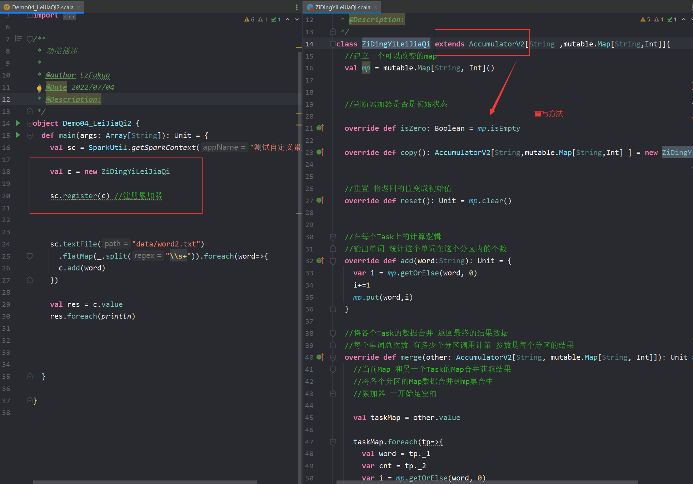
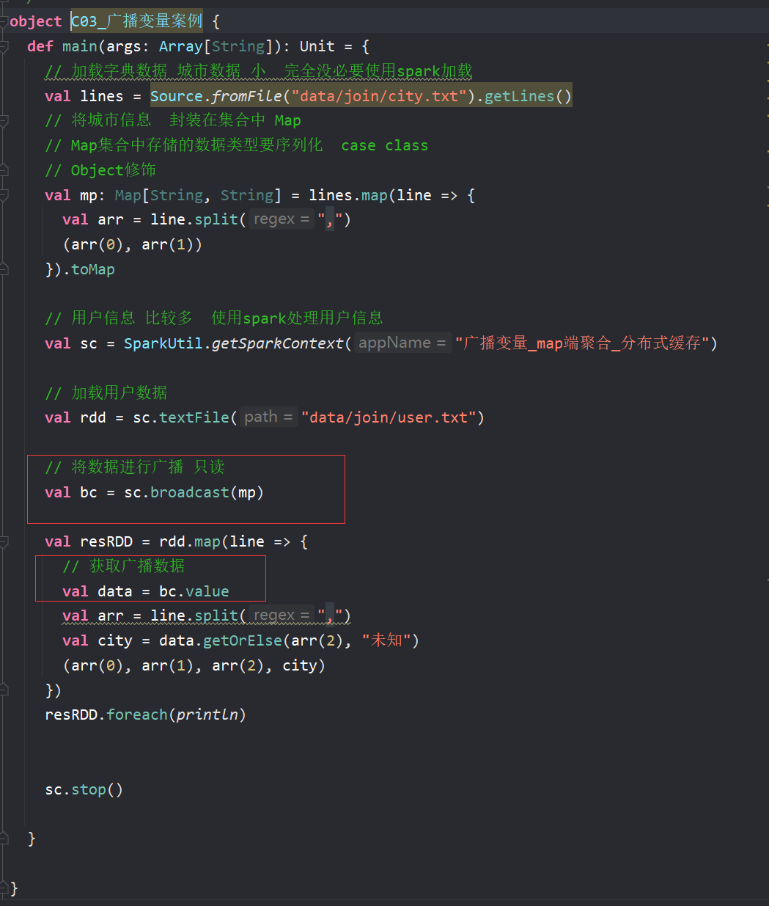

###什么是Spark
Spark是一种基于内存的计算的开源框架,核心是RDD

---

###介绍一下shuffer
shuffer也就是洗牌的意思,定义为数据无法完成想要的结果需要重新分来得到结果的过程,而shuffer的动态效果就是上游节点汇聚到不同的节点也就是一个人生了多胎.
在之前的版本默认是Hashshuffer,现在的3.0spark中shuffer有三种,这些都归于shuffermanager来管
第一种为BypassMergeSortShuffle,要求map端不能聚合且分区数不能大于200
第二种为unsafeShuffer,要求必须能序列化且不能map端聚合以及reduce不得多于2^24个
第三种为sortshuffer,前两种都不满足就会使用这一个

---

###什么是分区
首先分区在Spark里RDD有分区,是RDD并行计算的最小单元,RDD的计算逻辑被划分为多片,每片为一个分区,分区的创建是为了更快更多量更高效的完成作业

---

###太多分区好吗
不好,因为一个分区代表一个任务,调度任务也是需要时间的所以也会影响效率或者造成资源浪费

###太少分区好吗
不好,因为分区太少会导致每个任务的数据量增大,对内存的要求就变高,并行度也会相应减少,效率也会低

---

###什么是分区器
首先Spark分区器只能用于keyvalue形式中的RDD,分区器描述的就是RDD的数据在各个分区的的分布规则
最常用的为Hashpartitioner分区器,另外还有Rangepartitioner分区器(使用到了水塘抽样算法)
还有就是自定义的分区器, 只需要继承partitioner 重写方法就行

###手写一个分区器

---

###什么是RDD
RDD是弹性分布式数据集,其内在与scala中的迭代器很相似,是封装数据逻辑的一个迭代器
RDD有五大特性
1. 计算函数特性,每个RDD封装着计算逻辑
2. 依赖或者叫血缘关系特性,RDD会存储着前面RDD信息用于提高容错
3. 分区特性,在RDD上有着并行计算的能力
4. 可选项的分区器特性
5. 可选项的位置优先特性,有着数据不动代码动的原则

---

###Spark standAlone模式下的client提交方式
该模式适合测试使用,因为如果要提交100个Application到集群上执行,那客户端就会开启多个Driver而出现网卡暴增的情况
1. client模式下提交任务之后会在客户端启动Driver进程
2. Driver会向Master为当前Application申请启动资源
3. 资源申请成功后,Driver调用TaskScheduler将任务发送到Worker端执行任务
4. Worker端将Task执行情况和执行结果返回给Driver端

###Spark standAlone模式下的cluster提交方式
1. cluster模式下提交应用程序之后,会向Master申请启动Driver
2. Master接收请求后,随机在一台Worker端启动Driver
3. Driver启动后向Master为Application申请资源
4. 资源申请成功后,Driver调用TaskScheduler将任务发送到Worker端执行任务
5. Worker将执行情况和执行结果返回给Driver端

###Spark Yarn模式下的client提交方式
1. 客户端提交了submit进程并向RM请求启动AM,并在客户端启动一个Driver
2. RS收到请求后随机在一台NM启动AM
3. AM启动后会去找RM申请一批容器用于请求启动Executor
4. RS收到请求后向AM返回一批NM节点
5. AM会向NM发送命令启动Executor
6. Executor进程启动后会向**Driver**反向注册，Executor全部注册完成后Driver开始执行main函数，之后执行到Action算子时，触发一个job，并根据宽依赖开始划分stage，每个stage生成对应的taskSet，之后将task分发到各个Executor上执行。

###Spark Yarn模式下的cluster提交方式
1. 客户端提交submit进程并向RM请求启动AM
2. RS收到请求后会在集群中随便找个NM启动AM(相当于Driver)
3. AM启动之后,向RS申请一批容器用于启动Executor
4. RS收到请求后,向A向AM返回一批NM节点
5. AM会向NM发送命令启动Executor
6. Executor进程启动后会向**AM**反向注册，Executor全部注册完成后AM开始执行main函数，之后执行到Action算子时，触发一个job，并根据宽依赖开始划分stage，每个stage生成对应的taskSet，之后将task分发到各个Executor上执行。

---

###stage的划分过程
以行动算子的runjob方法开始提交,根据RDD的血缘关系生成DAG有向无环图,再去Dviver端调用里面的dagScheduler方法,,拿到DAG后去根据当前job的finalRDD往前推断,遇到了窄依赖就将该RDD收入到stage里,而遇到宽依赖也就是Shuffle就会从该处切开生成新的stage,而一共只有两个stage名字,在结尾的叫resultstage,其余的都是shufferMapStage

---

###reduceByKey与groupByKey的区别,哪一种更具优势?
redeceBykey按照key进行聚合,在shuffer之前有预聚合的操作,返回结果是RDD
> reduceByKey((x1,x2)=>x1+x2) x1为第一个元素,之后为每次计算的结果 x2为之后的元素
> 
groupByKey按照key进行聚合分组,直接进行shuffer

---

###Repartition和Coalesce 的关系与区别
关系就是他们都能改变分区数,
区别就是coalesce默认是不shuffer的一般用来减少分区
而repartition一般用来增加分区

---

###简述下Spark中的缓存(cache和persist)与checkpoint机制，并指出两者的区别和联系 
**cache**和**persist**的数据是缓存到内存或者HDFS上,会被清除,不会切断依赖链
而**checkpoint**的数据是永久保存到HDFS上,会斩断链条
一般checkpoint之前先要persist,这样执行起来会快一些

---

###简述Spark中共享变量（广播变量和累加器）的基本原理与用途(还有闭包)
累加器是一种分布式的变量器,即分布式改变,累加器就聚合这些事件,一般用来对作业执行过程的事件进行计数,只有执行了行动算子才会触发累加器
> 

> 自定义累加器
> 

广播变量是在每个worker端缓存一份不可变的只读的相同的变量,该节点的每个任务都能访问,起到节省资源和优化的作用,通常用来分发较大的对象
>

闭包为函数可以访问函数外部定义的变量,而在函数内改变变量不会改变外部的变量

---

###Spark内存分布
现版本的分了三个大区
1. 统一内存区占了百分之六十,里面分了缓存内存区和执行缓存区
2. 其他区,占了百分之四十,用于定义自定义数据结构或者是存放Spark元数据
3. 预留区,默认为300M用来进行容错性

---

###spark-sql 中 dataset--dateframe--RDD的转化方式
> 1. RDD转换成dataset 
>   1. 需要隐式传入 import spark.implicits._ 然后createDataSet(rdd)
>   2. .toDS方法
> 2. RDD转换成dataframe
>   1. 元组类型的RDD可以直接转成df .toDF方法
>   2. caseclass类 createDataFrame(rdd,classof[xxx]) 反射
>   3. java类 需要一整套javabean后才能反射传入 (get方法要实现)
> 3. ds或者df转成RDD --> 直接 ds.rdd / df.rdd
> 4. ds转df .toDF()方法  括号里可以加字段名
> 5. df转ds 
>   1. .as[case class] 传入一个case class类型
>   2. frame.map({case Row (id:Int,name:String,age:Int)=> case class(id,name,age)}) 模式转换

---

###如何理解RDD,DataFrame,DataSet 
1. RDD是弹性分布式数据集,是Spark中最基本的数据抽象
2. DataFrame是一个分布式数据容器,每一行的固定类型为ROW,还记录了数据的结构信息(schema),性能上比RDD要高(因为执行计划得到了优化),但不安全
3. DataSet每一行的数据类型都是不确定的,dataframe为dataset的一类而已,dataset[ROW]

---

###spark-sql 底层转换原理(执行过程)
1. sql语句会传入到sqlparser中生成一个未绑定元数据的逻辑执行计划
2. 接着传入到Analyzer分析器中去绑定元数据信息catalog,然后返回一个DataSet
3. 再传入到optimizer优化器中去进行优化,优化有谓词下推,列裁剪,常量替换,常量累加等等
4. 传入到planner中生成物理执行计划
5. 调用execute方法触发了里面的getByteArrayRDD,调用了docodeGen以及inputRDDs
6. docodeGen是将代码进行了编译,反射,实例化,生成了一个包含stage的计算逻辑的迭代器,而inputRDDs是调用用了mappartitionswithindex将迭代器传入后生成了一个新的RDD,这个RDD就可以用来做打印等事情

---

### 任务生成的全过程
1. 调用SparkSubmit类，内部执行submit --> doRunMain -> 通过反射获取应用程序的主类对象 --> 执行主类的main方法。
2. 构建SparkConf和SparkContext对象，在SparkContext入口做了三件事，创建了SparkEnv对象（创建了ActorSystem对象），TaskScheduler（用来生成并发送task给Executor），DAGScheduler（用来划分Stage）。
3. ClientActor将任务信息封装到ApplicationDescription对象里并且提交给Master。
4. Master收到ClientActor提交的任务信息后，把任务信息存在内存中，然后又将任务信息放到队列中。
5. 当开始执行这个任务信息的时候，调用scheduler方法，进行资源的调度。
6. 将调度好的资源封装到LaunchExecutor并发送给对应的Worker。
7. Worker接收到Master发送过来的调度信息（LaunchExecutor）后，将信息封装成一个ExecutorRunner对象。
8. 封装成ExecutorRunner后，调用ExecutorRunner的start方法，开始启动 CoarseGrainedExecutorBackend对象。
9. Executor启动后向DriverActor进行反向注册。
10. 与DriverActor注册成功后，创建一个线程池（ThreadPool），用来执行任务。
11. 当所有的Executor注册完成后，意味着作业环境准备好了，Driver端会结束与SparkContext对象的初始化。
12. 当Driver初始化完成后（创建了sc实例），会继续执行我们提交的App的代码，当触发了Action的RDD算子时，就触发了一个job，这时就会调用DAGScheduler对象进行Stage划分。
13. DAGScheduler开始进行Stage划分。
14. 将划分好的Stage按照区域生成一个一个的task，并且封装到TaskSet对象，然后TaskSet提交到TaskScheduler。
15. TaskScheduler接收到提交过来的TaskSet，拿到一个序列化器，对TaskSet序列化，将序列化好的TaskSet封装到LaunchExecutor并提交到DriverActor。
16. 把LaunchExecutor发送到Executor上。
17. Executor接收到DriverActor发送过来的任务（LaunchExecutor），会将其封装成TaskRunner，然后从线程池中获取线程来执行TaskRunner。
18. TaskRunner拿到反序列化器，反序列化TaskSet，然后执行App代码，也就是对RDD分区上执行的算子和自定义函数。

---

###为什么scala的迭代器上的map/flatmap...算子，具有lazy执行的特性？
> scala迭代器里的那些转换算子底层并没有调用HashNext和Next方法,而是根据逻辑创建了一个新的迭代器

###为什么rdd的transformation算子，具有lazy执行的特性？
> 因为RDD的转换算子底层没有触发阶段划分,job提交或者task提交的动作,而只是根据逻辑创健了一个新的RDD实例返回

###为什么说rdd中并没有真正存储数据？而触发rdd上的行动算子时又能拿到计算结果是为什么？
> 因为RDD存储的是里面的compute方法套了前一个rdd的转换逻辑,而行动算子触发了runjob,会追溯到初代RDD获取数据的位置再根据计算逻辑处理数据得到结果

###闭包引用变量和广播变量的区别
> 闭包引用变量会跟着task一起序列化,就会每个task都有一份数据
> 而广播变量就将变量放到worker端,供task去读取,且有BT协议,在Task中可以互相传播

###execute端是什么样的角色
> execute是一个计算任务的进程,收到Dviver端调度过来的task放到线程池里去运行

###Ordering的解释
> Ordering类似于Java中的Comparator,提供一个第三方的比较器用来自定义比较两个对象的大小

###RDD的分区数是如何决定的
> 1.参数指定 2.根据父类RDD的redeceTasks数量 3.HDFS切片数

###为什么需要划分Stage?
> 因为一个job任务中可能会有大量的宽窄依赖出现,划分stage就是让一些任务能都是窄依赖然后去并行的去执行任务,提高效率

###spark 脚本中的jar 是什么意思  
> 这些 jar 将被包含在 driver 和 executor 的 classpath 下执行jar包

###spark做缓存时候缓存在哪里
>在executor的内存里

###map 和 mappartition 算子的区别
1. map是对RDD的所有元素进行操作
2. mappartition是将函数作用到分区级别,也就是对所有RDD分区进行操作 但可能会引发OOM(内存溢出)

---

## Spark中的数据倾斜问题和解决的方法
### 什么是数据倾斜?
数据倾斜是某些分区的执行速度比别的分区慢很多

### 数据倾斜是如何造成的?
在Spark中同一个应用程序划分成多个stage，这些stage之间是串行执行的，而一个stage里面的多个task是可以并行执行，task数目由partition数目决定，如果一个partition的数目特别大，那么导致这个task执行时间很长，导致接下来的stage无法执行，从而导致整个job执行变慢。数据倾斜一般来说都是由于某个key值特别多.

### 如何定位Spark数据倾斜问题?
（1）通过Spark Web UI去查看task执行情况，查看到底是在哪个stage阶段下卡住了，然后再去我们的程序代码中，查看涉及到shuffle操作算子有哪些；
（2）如果数据倾斜导致出现了OOM情况，可以通过去Yarn的日志中进行定位查看，看看是执行到第几个stage，哪个stage下的哪个task执行得特别慢，定位到具体的stage之后，再到程序代码中定位到具体发生数据倾斜的算子是哪个；

### Spark解决数据倾斜的方案
（1）方案1：抽样统计key的个数
①选取key，对数据进行抽样，统计出每个key出现的次数，根据出现次数大小进行排序，如果发现多数key分布都比较平均，而只有个别的key数据量是非常大的，则说明发生了数据倾斜；
②接着对发生数据倾斜的key进行过滤出来，单独进行处理(添加随机前缀或自定义分区)，处理完之后，再与前面的结果进行union操作即可；
（2）方案2：提高shuffle操作的reduce端的并行度
①提高shuffle操作的reduce并行度，增加reduce task的数量，就可以让每个reduce task分配到更少的数据量，这样的话，有很大的可能就可以缓解数据倾斜问题，或者说基本解决掉数据倾斜的问题；
（3）方案3：将reduce join 转换为map join，对小表进行广播
①如果两个数据量差异较大的表做join时，发生了数据倾斜，我们一般将小表广播到每个节点去，这样就可以实现map端join，从而省掉shuffle阶段，避免了大量数据在个别节点上的进行汇聚，执行效率也得到了提升；
（4）方案4：两阶段聚合（局部聚合+全局聚合）
将原本相同的key通过添加随机前缀的方式，变成多个不同的key，就可以让原本被一个task处理的数据分散到多个task上去做局部聚合，这样就解决了单个task处理数据量过多的问题。接着去除掉随机前缀，再次进行一次全局聚合，就可以得到最终的结果；
（5）方案5：提高数据的处理频率,降低单次数据处理量,批次投入到partition中,这样数据量就会少一些
（6）方案6：减少spark任务的并行度,减少executor数量,但增加executor内存和核数
（7）方案7: 精简字段,让value的大小减少

---
###为什么Spark Application在没有获得足够的资源，job就开始执行了，可能会导致什么什么问题发生?
会导致执行该job时候集群资源不足，导致执行job结束也没有分配足够的资源，分配了部分Executor，该job就开始执行task，应该让task的调度线程和Executor资源申请是异步的；
所以应该申请完所有的资源再执行job
需要将

spark.scheduler.maxRegisteredResourcesWaitingTime 这个参数设置的大一些
在执行前最大等待申请资源的时间，默认30s。 

spark.scheduler.minRegisteredResourcesRatio 这个设置为 1
实际注册的资源数占预期需要的资源数的比例，默认0.8
但是应该结合实际考虑否则很容易出现长时间分配不到资源，job一直不能运行的情况。

---
###MR和spark的区别
1. MR的map端中间结果会落到磁盘上,而spark是存到内存中
2. MR是多进程单线程,Spark是多进程多线程
3. MR运行在yarn上,spark有local standAlone yarn模式
4. spark容错高,因为RDD有依赖关系实现计算流程的重建,而mapreduce就只能重新计算
5. spark的API比MR要更多一些,spark更灵活
---
###MR和sparkshuffle有什么区别
1. 功能上,MR的shuffle和sparkshuffle没什么区别,都是map端的数据分区
2. 但方案上MRshuffle是基于合并排序的思想进行,而spark是可选择的聚合

---

###spark sql 和 hive sql的区别
spark的计算引擎就是spark本身,而hive计算引擎是MR,且sparksql有很多优化在opitimizer里.

###spark join有几种 分别是什么  
