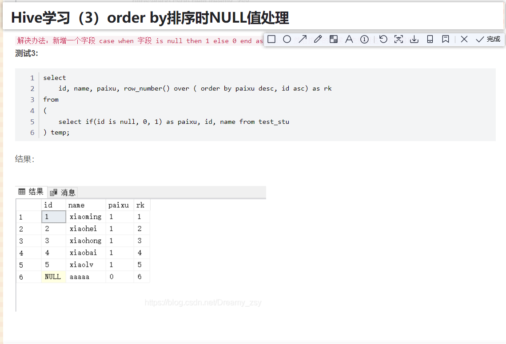
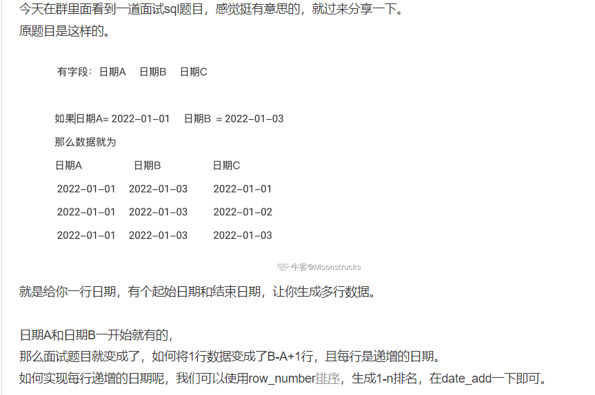
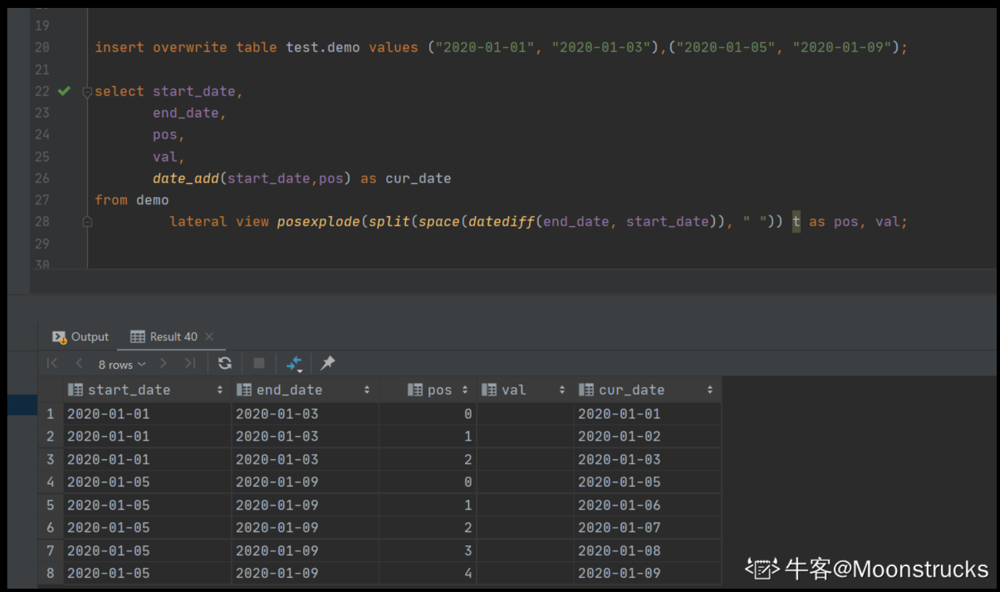
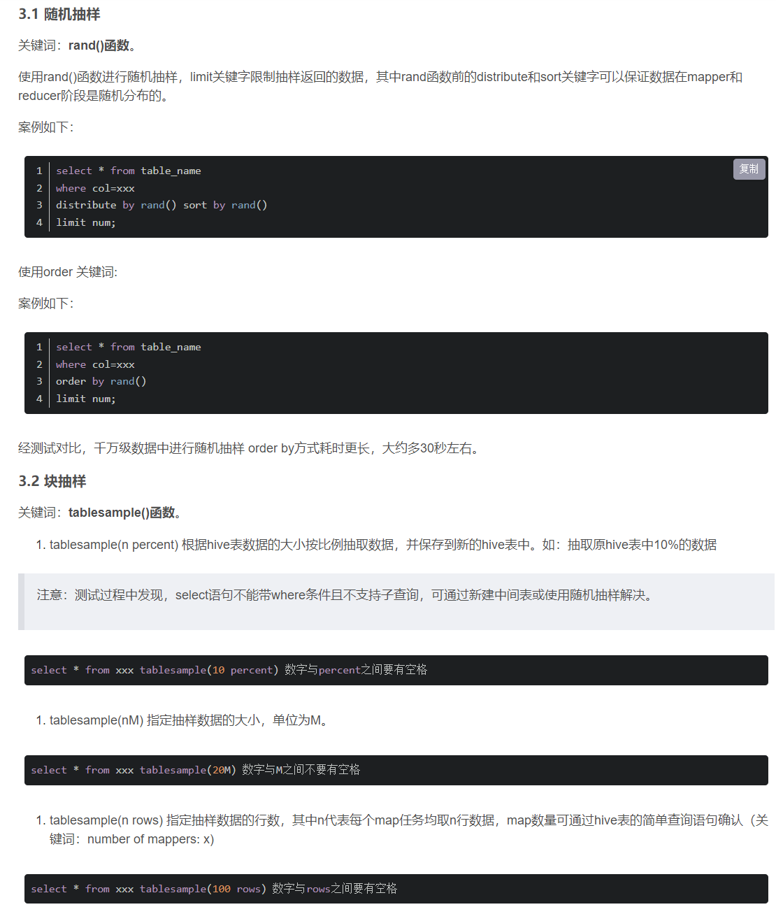

### 日期转时间戳
unix_timestamp(yyy-MM-dd HH:mm:ss)

### sql执行顺序
1. from 
2. join 
3. ON 
4. WHERE 
5. GROUP 
6. WITH 
7. HAVING 
8. SELECT
9. union
10. DISTINCT
11. ORDER BY 
12. LIMIT

### sum 空值  sum空串  count空值 count 空串的区别  
count(*)不忽略null值 count(字段名)忽略null值
null是一个空的意思 而空串不代表空 

### on和where的区别
1. on条件是在生成临时表时使用的条件，它不管on中的条件是否为真，都会返回左边表中的记录。即筛选列即使为False也可能保留对应的行，

2. where条件是在临时表生成好后，再对临时表进行过滤的条件。这时已经没有left join的含义（必须返回左边表的记录）了，条件不为真的就全部过滤掉。


### 日期函数
now 
current_timestamp 
current_date
date()
date_diff 
date_sub
unix_timestamp()

### 窗口函数
ntile()分区内数据N等份，返回当前行所在的位置

### 列转行
mysql用max与if的结合
hive用collect_set/list 组成一个字段

### 行转列
mysql用到了union all
hive用到了炸裂函数 LATERAL VIEW explode


### 中位数 
rownumber排名之后 where 条件  这个值在 n/2 n/2+1 (n+1)/2 这三个就行


### 连续登录 
1. 先用distinct 去重 用rownumber减日期 group by 后 求count来完成
2. 用group by后 datediff(dt,lag(dt,x-1,9999.12.31)over(partition by uid order by dt asc)) as datediff做 然后where datediff = x-1 (最后再distinct一下 )
3.  思路:也就是判断该用户排序后当天的日期减去往上几行的日期的时间差刚好是where条件的,那就证明他连续登录了. 


---
### Hive行转列
```sql
原始数据
name       gender          times
张三         男            唐
李四         男            唐
王五         男            明
赵六         男            明

-- 先用collect_set将列拼接在一起，然后再通过concat_ws进行展开拼接
SELECT 
    a.gender_times, concat_ws(';',collect_set(a.name)) name
FROM
(
    SELECT 
        name, collect_set(gender, '_','times') gender_times
    FROM hero_info
) tmp
GROUP BY t.gender_times
 
查询结果
gender_times    name    
男_唐     张三;李四
男_明     王五;赵六

```
### Hive列转行
```sql

/*原始数据
province       city
河南           郑州市,开封市，洛阳市
河北           石家庄市，保定市
湖南           长沙市，岳阳市，常德市
*/
 
-- addr为表名
SELECT
    province, city_n
FROM addr 
LATERAL VIEW explode (split(city,',')) addr_tmp AS city_n
 
/*
-- 查询结果
河南      郑州市
河南      开封市
河南      洛阳市
河北      石家庄市
河北      保定市
湖南      长沙市
湖南      岳阳市
湖南      常德市
*/
```
---
### Hive order by 排序时null值的处理



### hive sql题 


简单来说就是用space函数去传入两值相减得到的天数生成一串(0 1 2)这样的内容,再用split切割后得到一串数组后炸开,再用select 查询时最后一天对每个炸开的数相减,就能得到日期


### Hive 随机抽样百分之10的数据


---


### hive留存

```sql
select
start_date,
user_cnt,
remain1_cnt,
remain3_cnt,
remain5_cnt,
 -- 留存率 = X 日留存用户数 / 基准日活跃用户数
 concat(round(remain1_cnt/user_cnt * 100,2),'%') as remain1_ratio,
 concat(round(remain3_cnt/user_cnt * 100,2),'%') as remain3_ratio,
 concat(round(remain5_cnt/user_cnt * 100,2),'%') as remain5_ratio
 from (
 select
 start_date,
 count(distinct a_userid) as user_cnt,
 -- 根据关联表的日期差计算出 X 日留存用户数
 count(distinct if (diff_date = 1,a_userid,null)) as remain1_cnt,
 count(distinct if (diff_date = 3,a_userid,null)) as remain3_cnt,
 count(distinct if (diff_date = 5,a_userid,null)) as remain5_cnt
 from (
 select
 a.userid as a_userid,
 a.start_date,
 b.userid as b_userid,
 b.end_date,
 datediff(b.end_date,a.start_date) as diff_date
  from (
   select
   userid,
   to_date(time) as start_date
   from user_log
   group by userid,to_date(time)
   ) a
   left join (
       select
       userid,
       to_date(time) as end_date
       from user_log
       group by userid,to_date(time)
       ) b
       on a.userid = b.userid
       where a.start_date <= b.end_date 
        ) t1
)t2;

 
```